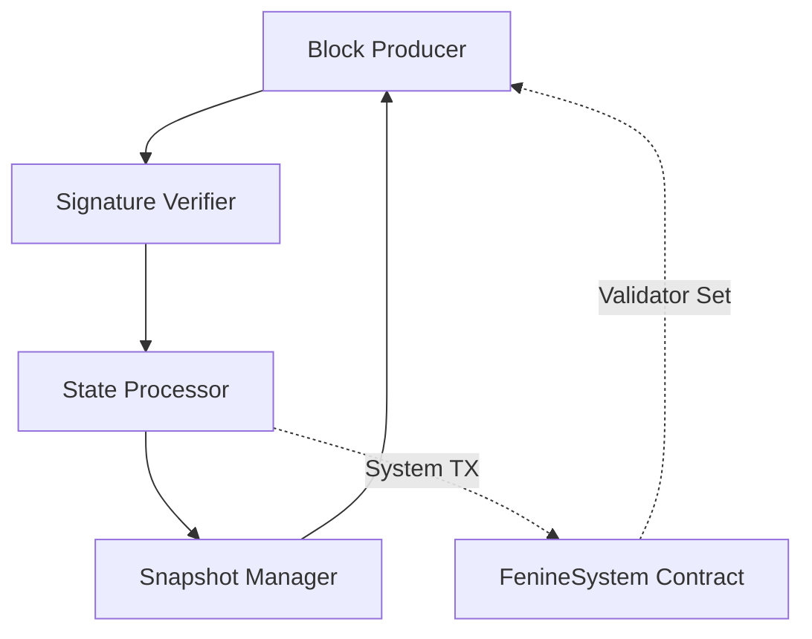

## Overview

The Fenines consensus layer implements a **Hybrid Proof-of-Authority (PoA)** mechanism named **Fenine**, which combines deterministic block production with smart contract-governed validator selection. This architecture decouples consensus validation from validator governance, enabling dynamic validator sets without protocol-level modifications.

<Info>
**Consensus Type**: Proof-of-Authority (PoA)  
**Signature Algorithm**: ECDSA (secp256k1)  
**Block Time**: 3 seconds ($T_{\text{block}} = 3s$)  
**Epoch Length**: 200 blocks ($E_{\text{period}} = 200$)
</Info>

## Consensus Engine Architecture

### Core Components

The Fenine consensus engine consists of four primary modules:



### Mathematical Foundation

#### 1. In-Turn Block Production

Validators produce blocks in a deterministic round-robin schedule defined by:

$$
\text{Signer}(B_n) = \mathcal{V}\left[n \bmod |\mathcal{V}|\right]
$$

where:
- $B_n$ = Block at height $n$
- $\mathcal{V}$ = Ordered validator set from FenineSystem contract
- $|\mathcal{V}|$ = Cardinality of active validators ($1 \leq |\mathcal{V}| \leq 101$)

#### 2. Difficulty Assignment

Block difficulty encodes the in-turn status:

$$
\text{Difficulty}(B_n) = \begin{cases}
2 & \text{if } \text{Signer}(B_n) = \text{Expected}(B_n) \\
1 & \text{otherwise (out-of-turn)}
\end{cases}
$$

<Note>
Difficulty serves as a **tie-breaker** during chain reorganizations, not a computational puzzle. Fenine uses signature verification, not hash-based mining.
</Note>

#### 3. Signature Verification

Each block header contains an ECDSA signature in the `extraData` field:

$$
\text{ExtraData} = \text{Vanity}_{32} \| \text{Signature}_{65}
$$

Signature verification ensures:

$$
\text{Verify}(\sigma, H_{\text{block}}, \text{PubKey}_{\text{signer}}) = \begin{cases}
\text{true} & \text{if } \sigma = \text{Sign}(H_{\text{block}}, \text{PrivKey}_{\text{signer}}) \\
\text{false} & \text{otherwise}
\end{cases}
$$

where:
- $\sigma$ = 65-byte ECDSA signature (R, S, V)
- $H_{\text{block}}$ = Keccak256 hash of block header (excluding signature)

## Block Production Protocol

### Timing Model

Block production follows strict timing constraints to prevent network partitioning:

$$
T_{\text{seal}} = T_{\text{parent}} + \text{Delay}(\text{position})
$$

where:

$$
\text{Delay}(\text{position}) = \begin{cases}
T_{\text{block}} & \text{if in-turn} \\
T_{\text{block}} + \frac{T_{\text{block}}}{2} & \text{if out-of-turn}
\end{cases}
$$

### Seal Algorithm

<Steps>
  <Step title="Header Preparation">
    ```go
    header.Difficulty = DIFF_INTURN  // or DIFF_NOTURN
    header.Coinbase = validatorAddress
    header.Extra = vanity[32] + placeholder[65]
    ```
  </Step>

  <Step title="Hash Computation">
    Compute block hash without signature:
    
    $$
    H_{\text{unsigned}} = \text{Keccak256}(\text{RLP}(\text{header}[:97]))
    $$
  </Step>

  <Step title="Signature Generation">
    Sign the hash using validator's private key:
    
    ```go
    signature = Sign(hash, privateKey)
    // signature = [R(32) || S(32) || V(1)]
    ```
  </Step>

  <Step title="Signature Embedding">
    Replace placeholder with actual signature:
    
    ```go
    header.Extra[32:97] = signature
    ```
  </Step>
</Steps>

### Anti-Split-Brain Protection

To prevent simultaneous node startup from creating chain splits, Fenine implements a random delay:

$$
\Delta T_{\text{startup}} \sim \mathcal{U}(0, T_{\text{block}})
$$

This ensures statistical convergence to a single canonical chain within:

$$
T_{\text{convergence}} = \mathcal{O}(\log n)
$$

blocks, where $n = |\mathcal{V}|$.

## Snapshot System

### Snapshot Data Structure

Snapshots cache validator sets to avoid repeated contract reads:

```go
type Snapshot struct {
    Number  uint64                      // Block height
    Hash    common.Hash                 // Block hash
    Signers map[Address]struct{}        // Authorized validators
    Recents map[uint64]Address          // Recent signers (spam protection)
}
```

### Snapshot Evolution

Snapshots evolve through the chain via the `apply()` function:

$$
\mathcal{S}_{n+1} = \text{apply}(\mathcal{S}_n, B_{n+1})
$$

where:

$$
\text{apply}(\mathcal{S}, B) = \begin{cases}
\text{loadFromContract}(B) & \text{if } B \bmod E_{\text{period}} = 0 \\
\mathcal{S} \cup \\{\text{Signer}(B)\\} & \text{otherwise}
\end{cases}
$$

### Snapshot Persistence

Snapshots are persisted to disk at **checkpoint intervals** to enable fast sync:

$$
\text{Checkpoint}(n) \iff n \bmod 1024 = 0
$$

Database key schema:

```
Key:   "fenine-" + BlockHash
Value: JSON(Snapshot)
```

### LRU Caching Strategy

In-memory caching follows a dual-LRU architecture:

| Cache | Capacity | Purpose |
|-------|----------|---------|
| `recents` | 128 snapshots | Recent validator sets |
| `signatures` | 4096 entries | Block signer addresses |

Cache hit rate analysis:

$$
P_{\text{hit}} = 1 - \left(\frac{|\mathcal{V}|}{C_{\text{capacity}}}\right)^k
$$

For $|\mathcal{V}| = 101$ and $C = 128$, hit rate exceeds 99% for $k > 2$ lookbacks.

## System Transaction Mechanism

### Epoch Boundary Protocol

At every epoch block ($n \bmod 200 = 0$), three system transactions execute atomically:

<Steps>
  <Step title="updateValidatorCandidates()">
    **Purpose**: Refresh active validator set from contract state
    
    **Function Selector**: `0x3c1cc290`
    
    **Effect**: Synchronizes $\mathcal{V}_{\text{consensus}}$ with $\mathcal{V}_{\text{contract}}$
    
    $$
    \mathcal{V}_{n+1} \leftarrow \text{FenineSystem.activeValidatorSet}
    $$
  </Step>

  <Step title="distributeBlockReward(uint256)">
    **Purpose**: Distribute epoch rewards to validators
    
    **Function Selector**: `0x9a2e5597`
    
    **Reward Calculation**:
    
    $$
    \Omega_{\text{epoch}} = R_{\text{block}} \times E_{\text{period}} = 1 \times 200 = 200 \text{ FEN}
    $$
    
    **Distribution**:
    
    $$
    \text{distribute}(\Omega) = \begin{cases}
    \text{splitAmongValidators}(\Omega, \mathcal{V}) & \text{if } |\mathcal{V}| > 0 \\
    \text{sendToTreasury}(\Omega) & \text{if } |\mathcal{V}| = 0
    \end{cases}
    $$
  </Step>

  <Step title="syncRewardState()">
    **Purpose**: Activate pending reward changes
    
    **Function Selector**: `0x4d73a62a`
    
    **State Transition**:
    
    $$
    R_{\text{active}} \leftarrow R_{\text{pending}} \text{ at epoch } E_{\text{activation}}
    $$
  </Step>
</Steps>

### System Transaction Properties

System transactions have special characteristics:

| Property | Value | Rationale |
|----------|-------|-----------|
| Gas Fee Cap | `baseFee` | Minimum EIP-1559 requirement |
| Gas Tip Cap | `0` | No priority fee |
| Sender | `block.coinbase` | Validator EOA |
| Gas Check | **Exempted** | Balance may be zero |
| Nonce | Auto-increment | Sequential ordering |

<Warning>
Validator EOAs should maintain **zero balance** to prevent accidental user transactions. System TXs are exempt from balance checks.
</Warning>

## Header Verification Rules

### Comprehensive Verification

The `verifyHeader()` function enforces **12 consensus rules**:

<Accordion title="1. Uncle Hash">
```go
if header.UncleHash != uncleHash {
    return ErrInvalidUncleHash
}
```

$$
H_{\text{uncle}} \stackrel{?}{=} \text{Keccak256}(\text{RLP}([]))
$$
</Accordion>

<Accordion title="2. Coinbase (Signer Recovery)">
```go
signer := ecrecover(header, signatures)
if signer != header.Coinbase {
    return ErrInvalidCoinbase
}
```

$$
\text{Coinbase} \stackrel{?}{=} \text{EcRecover}(\sigma, H_{\text{block}})
$$
</Accordion>

<Accordion title="3. Timestamp Monotonicity">
```go
if header.Time <= parent.Time {
    return ErrInvalidTimestamp
}
```

$$
T_n > T_{n-1}
$$
</Accordion>

<Accordion title="4. Block Time Constraint">
```go
if header.Time < parent.Time + period {
    return ErrInvalidTimestamp
}
```

$$
T_n \geq T_{n-1} + T_{\text{block}}
$$
</Accordion>

<Accordion title="5. Nonce Check">
```go
if header.Nonce != nonceAuthVote {
    return ErrInvalidNonce
}
```

Nonce must be `0x0000000000000000` (no voting in Fenine).
</Accordion>

<Accordion title="6. ExtraData Length">
```go
if len(header.Extra) < extraVanity+extraSeal {
    return ErrInvalidExtraData
}
```

$$
|\text{ExtraData}| \geq 32 + 65 = 97 \text{ bytes}
$$
</Accordion>

<Accordion title="7. Mix Digest">
```go
if header.MixDigest != (common.Hash{}) {
    return ErrInvalidMixDigest
}
```

Must be zero (no PoW mining).
</Accordion>

<Accordion title="8. Difficulty">
```go
expected := CalcDifficulty(chain, header.Time, parent)
if header.Difficulty.Cmp(expected) != 0 {
    return ErrWrongDifficulty
}
```

$$
D_n = \begin{cases}
2 & \text{if in-turn} \\
1 & \text{if out-of-turn}
\end{cases}
$$
</Accordion>

<Accordion title="9. Signature Validity">
```go
if err := ecrecover(header, signatures); err != nil {
    return ErrInvalidSignature
}
```

ECDSA signature must be valid.
</Accordion>

<Accordion title="10. Signer Authorization">
```go
snap := getSnapshot(parent)
if _, ok := snap.Signers[signer]; !ok {
    return ErrUnauthorizedSigner
}
```

$$
\text{Signer}(B_n) \in \mathcal{V}_n
$$
</Accordion>

<Accordion title="11. Recent Signer Check">
```go
for seen, recent := range snap.Recents {
    if recent == signer {
        limit := (len(snap.Signers)/2 + 1)
        if number-seen < uint64(limit) {
            return ErrRecentlySigned
        }
    }
}
```

Prevents spam by enforcing minimum gap:

$$
B_{\text{current}} - B_{\text{last\_signed}} \geq \left\lfloor \frac{|\mathcal{V}|}{2} \right\rfloor + 1
$$
</Accordion>

<Accordion title="12. Gas Limit Validation">
```go
diff := int64(parent.GasLimit) - int64(header.GasLimit)
if diff < 0 {
    diff *= -1
}
if uint64(diff) >= parent.GasLimit/1024 {
    return ErrInvalidGasLimit
}
```

Gas limit may only change by ±1/1024 per block:

$$
\left| G_{n} - G_{n-1} \right| < \frac{G_{n-1}}{1024}
$$
</Accordion>

## Block Difficulty Calculation

### CalcDifficulty Algorithm

```go
func (r *Fenine) CalcDifficulty(chain ChainHeaderReader, 
                                 time uint64, 
                                 parent *types.Header) *big.Int {
    snap := r.snapshot(chain, parent.Number.Uint64(), parent.Hash(), nil)
    return calcDifficulty(snap, r.signer)
}
```

### In-Turn Status Determination

$$
\text{InTurn}(n, s) \iff \mathcal{V}\left[n \bmod |\mathcal{V}|\right] = s
$$

where:
- $n$ = Block number
- $s$ = Signer address
- $\mathcal{V}$ = Sorted validator set (lexicographic order)

### Lexicographic Ordering

Validators are sorted by address to ensure determinism:

```go
func (s *Snapshot) inturn(number uint64, signer common.Address) bool {
    signers := s.signers()
    offset := number % uint64(len(signers))
    return signers[offset] == signer
}

func (s *Snapshot) signers() []common.Address {
    signers := make([]common.Address, 0, len(s.Signers))
    for signer := range s.Signers {
        signers = append(signers, signer)
    }
    sort.Slice(signers, func(i, j int) bool {
        return bytes.Compare(signers[i][:], signers[j][:]) < 0
    })
    return signers
}
```

## Finality Semantics

### Probabilistic Finality

Fenine provides **probabilistic finality** based on confirmation depth:

$$
P_{\text{finality}}(k) = 1 - \left(\frac{1}{2}\right)^k
$$

where $k$ is the number of confirmations.

| Confirmations | Finality Probability | Time (3s blocks) |
|---------------|----------------------|------------------|
| 1 | 50% | 3s |
| 2 | 75% | 6s |
| 3 | 87.5% | 9s |
| 6 | 98.4% | 18s |
| 12 | 99.98% | 36s |

<Info>
**Recommended Confirmations**: 
- Small transactions: 3 blocks (9s)
- Medium value: 6 blocks (18s)  
- High value: 12 blocks (36s)
</Info>

### Economic Finality

For transactions exceeding $V_{\text{tx}}$, required confirmations:

$$
k_{\text{safe}} = \left\lceil \log_2\left(\frac{V_{\text{tx}}}{V_{\text{stake}}}\right) \right\rceil
$$

where $V_{\text{stake}}$ is the minimum validator stake (10,000 FEN).

## Chain Reorganization Handling

### Fork Choice Rule

During competing chains, selection follows:

$$
\text{Chain}_{\text{canonical}} = \arg\max_{\mathcal{C}} \\left\\{ \sum_{B \in \mathcal{C}} D(B), \; |\mathcal{C}| \\right\\}
$$

where:
1. Prefer chain with higher cumulative difficulty
2. Tie-break by chain length
3. Tie-break by lexicographically smallest block hash

### Reorg Protection

Maximum reorganization depth is bounded by:

$$
\text{Reorg}_{\text{max}} = \min(128, E_{\text{period}})
$$

Beyond 128 blocks, snapshots are checkpointed and considered immutable.

## Performance Metrics

### Block Production Latency

End-to-end block production time decomposition:

$$
T_{\text{total}} = T_{\text{exec}} + T_{\text{seal}} + T_{\text{propagate}}
$$

Typical values:

| Component | Time | Percentage |
|-----------|------|------------|
| Transaction Execution | 50-500ms | 1.7-16.7% |
| Block Sealing | 1-5ms | 0.03-0.17% |
| Network Propagation | 100-300ms | 3.3-10% |
| **Consensus Overhead** | **~2-2.5s** | **66-83%** |

### Throughput Characteristics

Theoretical limits:

$$
\begin{align*}
\text{TPS}_{\text{transfer}} &= \frac{30,000,000}{21,000 \times 3} \approx 476 \text{ TPS} \\
\text{TPS}_{\text{ERC20}} &= \frac{30,000,000}{65,000 \times 3} \approx 154 \text{ TPS} \\
\text{TPS}_{\text{swap}} &= \frac{30,000,000}{150,000 \times 3} \approx 67 \text{ TPS}
\end{align*}
$$

## Consensus Safety Guarantees

### Byzantine Fault Tolerance

Safety threshold:

$$
f < \frac{n}{2}
$$

where:
- $f$ = Number of Byzantine validators
- $n$ = Total active validators

### Liveness Guarantee

Chain progresses if:

$$
|\mathcal{V}_{\text{honest}}| \geq 1
$$

Even a single honest validator ensures liveness (though centralization risk).

### Censorship Resistance

Transaction inclusion probability after $k$ blocks:

$$
P_{\text{inclusion}}(k) = 1 - \left(\frac{f}{n}\right)^k
$$

For $f/n = 0.3$ (30% adversarial):

- $k=1$: 70% chance
- $k=3$: 97.3% chance  
- $k=5$: 99.76% chance

## Related Topics

<CardGroup cols={2}>
  <Card title="System Contracts" icon="file-contract" href="/architecture/execution">
    FenineSystem contract specification
  </Card>
  <Card title="FPoS Economics" icon="coins" href="/architecture/fpos">
    Validator selection and rewards
  </Card>
  <Card title="Security Model" icon="shield-halved" href="/architecture/security">
    Attack vectors and mitigations
  </Card>
  <Card title="Network Parameters" icon="sliders" href="/architecture/parameters">
    Configurable consensus constants
  </Card>
</CardGroup>
