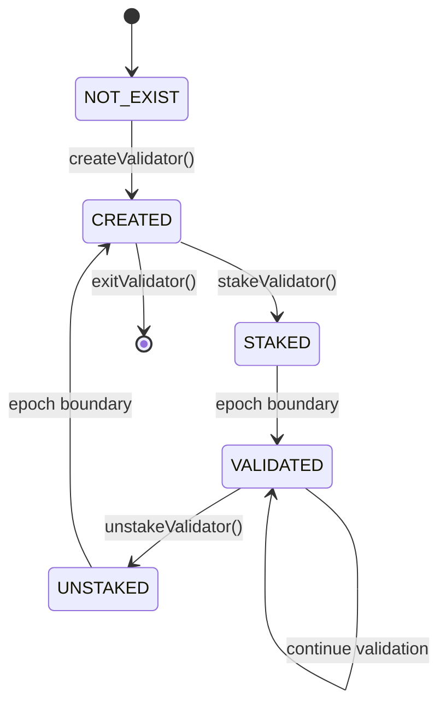

## Introduction

**Finality Proof-of-Stake (FPoS)** represents a fundamental reimagining of delegated consensus mechanisms, transcending traditional DPoS limitations through **contract-layer validator governance** and **hierarchical proximity incentives**. Unlike systems where validators are hardcoded at the protocol level (BNB Chain, Cosmos), Fenines implements validator selection entirely within smart contracts, enabling dynamic governance without hard forks.

<Info>
**Innovation**: Smart contract-governed validators + 8-level proximity rewards  
**Economic Model**: Nash equilibrium-driven delegation  
**Decentralization**: Byzantine fault tolerance with $n \leq 101$ validators
</Info>

## Architectural Innovations

### 1. Layer Separation Theorem

FPoS achieves orthogonal separation between consensus and governance:

$$
\mathcal{L}_{\text{consensus}} \cap \mathcal{L}_{\text{governance}} = \emptyset
$$

**Consensus Layer** ($\mathcal{L}_C$):
- Block production (Fenine PoA engine)
- Signature verification (ECDSA secp256k1)
- Finality guarantees (probabilistic)

**Governance Layer** ($\mathcal{L}_G$):
- Validator selection (FenineSystem contract)
- Stake management (ERC-20-like accounting)
- Reward distribution (proximity-aware)

**Benefit**: Validator set updates without protocol changes.

### 2. Hierarchical Proximity Model

The proximity system implements an **8-level reward cascade**:

$$
\mathcal{G} = (V, E, w)
$$

where:
- $V$ = Set of all delegators
- $E \subseteq V \times V$ = Directed edges (delegation relationships)
- $w: E \to [0, 1]$ = Weight function (proximity coefficients)

**Graph Properties**:

1. **Acyclicity**: $\forall v \in V: v \not\in \text{ancestors}(v)$
2. **Bounded Depth**: $\text{depth}(v) \leq 8$
3. **Single Parent**: $|\text{parent}(v)| \leq 1$

### 3. Economic Equilibrium

FPoS converges to a **Nash equilibrium** where no rational actor benefits from unilateral strategy change.

**Delegator Optimization**:

$$
\max_{v \in \mathcal{V}} \mathbb{E}[R_i(v)] = \max_{v} \\left\\{ \frac{R_v \cdot (1-\gamma_v) \cdot (1-P_{\text{prox}}) \cdot (1-\tau)}{S_v^{\text{total}} + S_i} \\right\\}
$$

subject to:

$$
S_i \geq S_{\text{min}}^{\text{DC}} = 1000 \text{ FEN}
$$

**Validator Optimization**:

$$
\max_{\gamma} \\left\\{ \gamma \cdot R_v^{\text{total}} \\right\\}
$$

subject to delegator retention constraint:

$$
\gamma \leq \gamma^* \implies \text{APY}_{\text{delegator}} \geq \text{APY}_{\text{market}}
$$

## Validator Lifecycle

### State Machine

Validators transition through 5 states:



### State Definitions

<Tabs>
  <Tab title="NOT_EXIST (0)">
    **Definition**: Address has never created a validator
    
    $$
    \text{VA}(addr) = \emptyset
    $$
    
    **Transitions**:
    - $\xrightarrow{\text{createValidator}}$ `CREATED`
  </Tab>

  <Tab title="CREATED (1)">
    **Definition**: Validator registered but not staked
    
    **Requirements**:
    - Commission rate set: $\gamma \in [0, 100]$
    - BLS public key provided (optional)
    
    **Transitions**:
    - $\xrightarrow{\text{stakeValidator}}$ `STAKED` (if $S \geq 10,000$ FEN)
    - $\xrightarrow{\text{exitValidator}}$ `NOT_EXIST`
  </Tab>

  <Tab title="STAKED (2)">
    **Definition**: Sufficient stake, pending activation
    
    **Invariant**:
    
    $$
    S_{\text{self}} \geq 10,000 \text{ FEN}
    $$
    
    **Activation Delay**:
    
    $$
    E_{\text{activation}} = E_{\text{stake}} + 1
    $$
    
    **Transitions**:
    - $\xrightarrow{\text{epoch}}$ `VALIDATED` (at next epoch if $|\mathcal{V}| < 101$)
    - $\xrightarrow{\text{unstakeValidator}}$ `CREATED`
  </Tab>

  <Tab title="VALIDATED (3)">
    **Definition**: Active validator, producing blocks
    
    **Responsibilities**:
    - Sign blocks in round-robin order
    - Execute system transactions at epochs
    - Maintain >99% uptime (best practice)
    
    **Earnings**:
    
    $$
    R_{\text{VA}} = \frac{\Omega_{\text{epoch}}}{|\mathcal{V}|} \times \gamma + R_{\text{delegator\_share}}
    $$
    
    **Transitions**:
    - $\xrightarrow{\text{unstakeValidator}}$ `UNSTAKED`
    - $\xrightarrow{\text{slashing}}$ `JAILED` (future hardfork)
  </Tab>

  <Tab title="UNSTAKED (4)">
    **Definition**: Deactivated, stake locked for cooldown
    
    **Cooldown Period**:
    
    $$
    T_{\text{cooldown}} = 1 \text{ epoch} = 600 \text{ seconds}
    $$
    
    **Transitions**:
    - $\xrightarrow{\text{epoch}}$ `CREATED` (can withdraw stake)
  </Tab>
</Tabs>

### Validator Selection Algorithm

At each epoch boundary, active set updated:

<Steps>
  <Step title="Read Candidates">
    Query all validators with status `STAKED`:
    
    $$
    \mathcal{C} = \\{v \in \text{AllValidators} : \text{status}(v) = \text{STAKED}\\}
    $$
  </Step>

  <Step title="Sort by Stake">
    Order by total stake (self + delegated):
    
    $$
    \mathcal{C}_{\text{sorted}} = \text{sort}(\mathcal{C}, S_{\text{total}}, \text{desc})
    $$
  </Step>

  <Step title="Select Top-N">
    Take up to 101 validators:
    
    $$
    \mathcal{V}_{\text{new}} = \mathcal{C}_{\text{sorted}}[:101]
    $$
  </Step>

  <Step title="Update State">
    Transition states:
    
    $$
    \begin{align*}
    \forall v \in \mathcal{V}_{\text{new}}: &\quad \text{status}(v) \leftarrow \text{VALIDATED} \\
    \forall v \in \mathcal{V}_{\text{old}} \setminus \mathcal{V}_{\text{new}}: &\quad \text{status}(v) \leftarrow \text{UNSTAKED}
    \end{align*}
    $$
  </Step>

  <Step title="Commit">
    Write active set to storage:
    
    ```solidity
    activeValidatorSet = newSet;
    emit ValidatorSetUpdated(epoch, newSet);
    ```
  </Step>
</Steps>

## Delegator Mechanics

### Staking Process

Delegators stake to validators with proximity tracking:

```solidity
function stake(address validatorAddress) external payable {
    require(msg.value >= MIN_DC_STAKE, "Insufficient stake");
    require(validators[validatorAddress].status == VALIDATED, "Invalid validator");
    
    // Create delegator record
    DelegatorInfo storage dc = delegators[msg.sender][validatorAddress];
    dc.stakeAmount = msg.value;
    dc.status = DC_ACTIVE;
    dc.joinedAt = block.number;
    
    // Add to validator's staker list (proximity array)
    dc.stakerIndex = validators[validatorAddress].stakers.length;
    validators[validatorAddress].stakers.push(msg.sender);
    
    // Update totals
    validators[validatorAddress].totalStake += msg.value;
    totalNetworkStake += msg.value;
}
```

**Proximity Position**:

$$
\text{ProximityDepth}(\text{DC}) = \text{stakerIndex} = |\mathcal{D}_{\text{validator}}| - 1
$$

Earlier delegators have **lower indices** → receive proximity from later delegators.

### Reward Accumulation

Rewards accrue each block:

$$
\Delta R_{\text{DC}}(B_n) = \frac{S_{\text{DC}}}{S_{\text{VA}}^{\text{total}}} \times R_{\text{VA}}^{\text{delegator\_pool}}
$$

**Pending Rewards**:

$$
R_{\text{pending}} = \sum_{i=B_{\text{joined}}}^{B_{\text{current}}} \Delta R_i
$$

### Proximity Distribution

When delegator claims, rewards flow through proximity chain:

$$
R_{\text{distributed}} = R_{\text{pending}} \times P_{\text{total}}
$$

where:

$$
P_{\text{total}} = \sum_{k=1}^{\min(d, 8)} \alpha_k
$$

**Level Coefficients** ($\alpha_k$):

| Level $k$ | $\alpha_k$ | Cumulative | Delegator Receives |
|-----------|-----------|------------|-------------------|
| - | - | - | $R \times (1 - 0.30)$ |
| 1 | 0.070 | 0.070 | Upline gets 7% |
| 2 | 0.050 | 0.120 | Upline-2 gets 5% |
| 3 | 0.040 | 0.160 | Upline-3 gets 4% |
| 4 | 0.035 | 0.195 | Upline-4 gets 3.5% |
| 5 | 0.030 | 0.225 | Upline-5 gets 3% |
| 6 | 0.025 | 0.250 | Upline-6 gets 2.5% |
| 7 | 0.025 | 0.275 | Upline-7 gets 2.5% |
| 8 | 0.025 | 0.300 | Upline-8 gets 2.5% |

**Ineligibility Handling**:

If upline at level $k$ is ineligible (unstaked, exited), the share redistributes:

$$
R_{\text{residual}}^{(k)} = R \times \alpha_k
$$

Split 50/50:

$$
\begin{align*}
\text{Claimer} &\gets R_{\text{residual}}^{(k)} \times 0.5 \\
\text{Validator} &\gets R_{\text{residual}}^{(k)} \times 0.5
\end{align*}
$$

### Tax Application

After proximity, tax deducted:

$$
R_{\text{final}} = R_{\text{after\_prox}} \times (1 - \tau)
$$

Tax distributed:

$$
\begin{align*}
R_{\text{burned}} &= R_{\text{tax}} \times 0.50 \\
R_{\text{dev}} &= R_{\text{tax}} \times 0.50
\end{align*}
$$

**Net Delegator Yield**:

$$
\text{Yield}_{\text{net}} = (1 - P_{\text{total}}) \times (1 - \tau) \times (1 - \gamma_v)
$$

For default params:

$$
\text{Yield}_{\text{net}} = 0.70 \times 0.90 \times (1 - \gamma) = 0.63 \times (1-\gamma)
$$

## Economic Model

### Tokenomics

<Tabs>
  <Tab title="Emission Schedule">
    **Block Reward**:
    
    $$
    R_{\text{block}} = 1 \text{ FEN}
    $$
    
    **Annual Emission**:
    
    $$
    E_{\text{annual}} = R_{\text{block}} \times \frac{365.25 \times 24 \times 3600}{T_{\text{block}}}
    $$
    
    $$
    E_{\text{annual}} = 1 \times \frac{31,557,600}{3} = 10,519,200 \text{ FEN/year}
    $$
    
    **Dynamic Adjustment**:
    
    Governance can update via RewardManager:
    
    ```solidity
    function updateBlockReward(uint256 newReward, uint256 activationEpoch) 
        external onlyGovernance
    ```
  </Tab>

  <Tab title="Deflationary Mechanics">
    **Burn Sources**:
    
    1. **EIP-1559 Base Fee**:
    
    $$
    B_{\text{1559}} = \text{BaseFee} \times G_{\text{used}}
    $$
    
    2. **Tax Burn**:
    
    $$
    B_{\text{tax}} = \sum_{\text{claims}} R_{\text{claim}} \times \tau \times 0.50
    $$
    
    **Total Burn**:
    
    $$
    B_{\text{total}} = B_{\text{1559}} + B_{\text{tax}}
    $$
    
    **Net Inflation**:
    
    $$
    I_{\text{net}} = E_{\text{annual}} - B_{\text{annual}}
    $$
    
    **Deflationary Threshold**:
    
    Network becomes deflationary when:
    
    $$
    \text{BaseFee}_{\text{avg}} \times G_{\text{avg}} \times \frac{31,557,600}{3} > E_{\text{annual}}
    $$
    
    For $E_{\text{annual}} = 10.52M$ FEN:
    
    $$
    \text{BaseFee}_{\text{avg}} > \frac{10,519,200}{G_{\text{avg}} \times 10,519,200} \times 10^{18}
    $$
    
    At $G_{\text{avg}} = 15M$:
    
    $$
    \text{BaseFee}_{\text{avg}} > 66.79 \text{ gwei}
    $$
  </Tab>

  <Tab title="APY Dynamics">
    **Validator APY**:
    
    $$
    \text{APY}_{\text{VA}} = \frac{R_{\text{annual}}^{\text{VA}}}{S_{\text{self}}} \times 100\%
    $$
    
    where:
    
    $$
    R_{\text{annual}}^{\text{VA}} = \frac{E_{\text{annual}}}{|\mathcal{V}|} \times \gamma + R_{\text{prox}}^{\text{from\_delegators}}
    $$
    
    **Delegator APY**:
    
    $$
    \text{APY}_{\text{DC}} = \frac{R_{\text{annual}}^{\text{DC}}}{S_{\text{DC}}} \times 100\%
    $$
    
    where:
    
    $$
    R_{\text{annual}}^{\text{DC}} = \frac{S_{\text{DC}}}{S_{\text{VA}}^{\text{total}}} \times R_{\text{VA}}^{\text{pool}} \times (1-\gamma) \times 0.63
    $$
    
    **Example Calculation**:
    
    Assumptions:
    - $|\mathcal{V}| = 50$ validators
    - $S_{\text{total}} = 100M$ FEN
    - $\gamma = 5\%$
    
    $$
    \begin{align*}
    R_{\text{annual}}^{\text{per\_VA}} &= \frac{10,519,200}{50} = 210,384 \text{ FEN} \\
    \text{APY}_{\text{base}} &= \frac{210,384 \times 0.95}{100M / 50} \times 100\% \\
    &= \frac{199,865}{2M} \times 100\% \\
    &\approx 10.0\%
    \end{align*}
    $$
    
    With proximity bonuses, effective APY can reach **12-15%**.
  </Tab>
</Tabs>

### Game Theory

#### Delegator Strategy

Rational delegators solve:

$$
\arg\max_{v \in \mathcal{V}} \text{APY}(v) = \arg\max_{v} \frac{R_v \times (1-\gamma_v) \times 0.63}{S_v^{\text{total}} + S_{\text{my}}}
$$

**Nash Equilibrium**:

All validators converge to similar APY:

$$
\forall v_i, v_j \in \mathcal{V}: \quad |\text{APY}(v_i) - \text{APY}(v_j)| < \epsilon
$$

where $\epsilon \approx 0.5\%$ (arbitrage threshold).

#### Validator Strategy

Validators compete on:

1. **Commission Rate**: Lower $\gamma$ attracts delegators
2. **Uptime**: Missed blocks reduce rewards
3. **Proximity Depth**: Early delegators incentivized to stay

**Optimal Commission**:

$$
\gamma^* = \arg\max_{\gamma} \\left\\{ \gamma \times S_{\text{total}}(\gamma) \\right\\}
$$

Empirically, $\gamma^* \in [3\%, 10\%]$ for competitive markets.

## Proximity Mathematics

### Fibonacci-Inspired Decay

The proximity coefficients follow a **modified Fibonacci sequence**:

$$
\alpha_k = \begin{cases}
0.07 & k = 1 \\
0.05 & k = 2 \\
0.04 & k = 3 \\
0.035 - 0.005 \times (k-4) & 4 \leq k \leq 6 \\
0.025 & 7 \leq k \leq 8
\end{cases}
$$

**Decay Rate**:

$$
\frac{\alpha_{k+1}}{\alpha_k} \approx 0.714 \text{ for } k \leq 2
$$

This mimics golden ratio decay:

$$
\phi = \frac{1 + \sqrt{5}}{2} \approx 1.618 \implies \frac{1}{\phi} \approx 0.618
$$

### Expected Value Analysis

For delegator at depth $d$:

**Expected Proximity Income**:

$$
\mathbb{E}[R_{\text{prox}}(d)] = \sum_{j=1}^{8} P(\text{downline at depth } j) \times \alpha_j \times \bar{R}_{\text{downline}}
$$

Assuming uniform distribution:

$$
\mathbb{E}[R_{\text{prox}}] \approx 0.30 \times \frac{\bar{N}_{\text{downlines}}}{8} \times \bar{R}
$$

where $\bar{N}_{\text{downlines}}$ = average downline count.

### Optimal Depth

Delegator utility maximization:

$$
U(d) = R_{\text{own}} + \mathbb{E}[R_{\text{prox}}(d)] - C_{\text{wait}}(d)
$$

where $C_{\text{wait}}(d)$ = opportunity cost of waiting for position $d$.

**Result**: Earlier positions ($d < 100$) have higher lifetime value.

## Network Dynamics

### Validator Growth Model

Network validator count evolves:

$$
\frac{d|\mathcal{V}|}{dt} = \lambda_{\text{join}} - \mu_{\text{exit}}
$$

where:

$$
\begin{align*}
\lambda_{\text{join}} &= f(\text{APY}, \text{barriers}) \\
\mu_{\text{exit}} &= g(\text{opportunity cost}, \text{slashing risk})
\end{align*}
$$

**Equilibrium**:

$$
|\mathcal{V}|^* : \lambda_{\text{join}} = \mu_{\text{exit}}
$$

Empirically, $|\mathcal{V}|^* \in [30, 80]$ for mature networks.

### Stake Concentration

Measure decentralization via **Nakamoto Coefficient**:

$$
N_c = \min\\left\\{ k : \sum_{i=1}^{k} S_i > \frac{1}{3} S_{\text{total}} \\right\\}
$$

**Healthy Range**: $N_c \geq 7$

**Gini Coefficient**:

$$
G = \frac{\sum_{i=1}^{n} \sum_{j=1}^{n} |S_i - S_j|}{2n^2 \bar{S}}
$$

Target: $G < 0.50$ (moderate inequality).

## Slashing Mechanism (Future)

<Warning>
Slashing is **not active** in current implementation. Planned for future hardfork.
</Warning>

### Slashable Offenses

| Offense | Severity | Slash % | Jail Time |
|---------|----------|---------|-----------|
| Double Sign | Critical | 5% | 7 days |
| Downtime (>50 blocks) | Major | 0.1% | 1 day |
| Invalid System TX | Critical | 10% | 30 days |

### Slash Formula

$$
S_{\text{new}} = S_{\text{old}} \times (1 - p_{\text{slash}})
$$

**Burned Amount**:

$$
B_{\text{slash}} = S_{\text{old}} \times p_{\text{slash}}
$$

### Evidence Submission

Validators submit fraud proofs:

```solidity
function submitDoubleSignEvidence(
    bytes calldata header1,
    bytes calldata header2,
    bytes calldata signature1,
    bytes calldata signature2
) external returns (bool)
```

**Reward for Reporter**:

$$
R_{\text{reporter}} = B_{\text{slash}} \times 0.10
$$

## Comparison with Other Systems

| Feature | Fenines FPoS | BNB Chain | Cosmos Hub | Ethereum PoS |
|---------|--------------|-----------|------------|--------------|
| Validator Selection | Smart contract | Hard-coded | On-chain governance | Permissionless |
| Max Validators | 101 | 21 | 175 | Unlimited |
| Min Stake | 10,000 FEN | 10,000 BNB | 1 ATOM (variable) | 32 ETH |
| Block Time | 3s | 3s | 5-7s | 12s |
| Finality | 18s (6 blocks) | 18s | 7s | 12.8 min |
| Slashing | Planned | Active | Active | Active |
| Proximity Rewards | ✅ 8 levels | ❌ | ❌ | ❌ |
| EIP-1559 Burn | ✅ | ✅ | ❌ | ✅ |

## Developer Integration

### Query Validator APY

```javascript
async function calculateValidatorAPY(validatorAddress) {
    const info = await fenineSystem.getValidatorInfo(validatorAddress);
    const epoch = await fenineSystem.getCurrentEpoch();
    
    // Estimate annual rewards
    const epochsPerYear = 365.25 * 24 * 3600 / 600; // ~52596
    const rewardPerEpoch = EPOCH_REWARD / activeValidators.length;
    const annualReward = rewardPerEpoch * epochsPerYear;
    
    // Commission earnings
    const commissionEarnings = annualReward * info.commissionRate / 10000;
    
    // Delegator share
    const delegatorPool = annualReward * (1 - info.commissionRate / 10000);
    const validatorDelegatorShare = 
        (info.selfStake / info.totalStake) * delegatorPool * 0.63;
    
    const totalEarnings = commissionEarnings + validatorDelegatorShare;
    const apy = (totalEarnings / info.selfStake) * 100;
    
    return apy;
}
```

### Estimate Delegator Returns

```javascript
async function estimateDelegatorReturns(
    delegatorAddress,
    validatorAddress,
    stakeAmount
) {
    const vaInfo = await fenineSystem.getValidatorInfo(validatorAddress);
    const dcInfo = await fenineSystem.getDelegatorInfo(
        delegatorAddress,
        validatorAddress
    );
    
    // Calculate share of validator's pool
    const newTotalStake = vaInfo.totalStake + stakeAmount;
    const share = stakeAmount / newTotalStake;
    
    // Annual delegator pool
    const epochsPerYear = 52596;
    const rewardPerEpoch = EPOCH_REWARD / activeValidators.length;
    const annualDelegatorPool = 
        rewardPerEpoch * epochsPerYear * 
        (1 - vaInfo.commissionRate / 10000);
    
    // Expected returns (before proximity)
    const baseReturns = annualDelegatorPool * share;
    
    // Apply proximity and tax
    const afterProximity = baseReturns * 0.70; // 30% to uplines
    const afterTax = afterProximity * 0.90; // 10% tax
    
    // Estimate proximity income (depends on downlines)
    const estimatedProximityIncome = baseReturns * 0.15; // conservative
    
    const totalReturns = afterTax + estimatedProximityIncome;
    const apy = (totalReturns / stakeAmount) * 100;
    
    return {
        apy,
        annualReturns: totalReturns,
        breakdown: {
            base: afterTax,
            proximity: estimatedProximityIncome
        }
    };
}
```

## Conclusion

Fenines FPoS establishes a **mathematically rigorous**, **economically sustainable** consensus framework that:

1. **Decouples** consensus from governance via dual-layer architecture
2. **Incentivizes** long-term participation through proximity rewards
3. **Balances** validator profitability with delegator returns
4. **Ensures** Byzantine fault tolerance with $n \leq 101$ validators
5. **Enables** deflationary tokenomics via EIP-1559 + tax burn

The proximity model creates **network effects** where early participants are rewarded for ecosystem growth, aligning incentives across validators, delegators, and the protocol itself.

<CardGroup cols={2}>
  <Card title="Staking Guide" icon="hand-holding-dollar" href="/guides/staking">
    How to become a validator or delegator
  </Card>
  <Card title="Economics Dashboard" icon="chart-line" href="https://stats.fene.app">
    Real-time APY and network metrics
  </Card>
  <Card title="Validator Setup" icon="server" href="/guides/validator-setup">
    Run a Fenines validator node
  </Card>
  <Card title="Governance Proposals" icon="landmark" href="/governance">
    Participate in protocol governance
  </Card>
</CardGroup>
