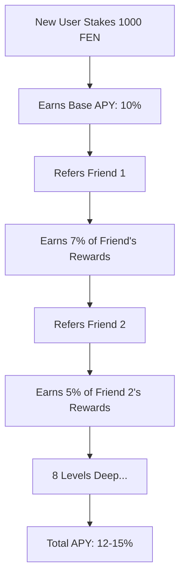

## Introduction

Fenine Network provides a **high-performance, EVM-compatible blockchain** optimized for DeFi, GameFi, and enterprise applications. With 3-second block times, novel FPoS consensus, and developer-friendly tooling, Fenine offers the perfect foundation for your next blockchain project.

<CardGroup cols={2}>
  <Card title="EVM Compatible" icon="ethereum">
    Deploy Solidity contracts without modifications
  </Card>
  <Card title="3-Second Finality" icon="bolt">
    18-second probabilistic finality for fast UX
  </Card>
  <Card title="Low Gas Fees" icon="dollar-sign">
    Transactions cost fractions of a penny
  </Card>
  <Card title="Unique Incentives" icon="network-wired">
    8-level proximity rewards for ecosystem growth
  </Card>
</CardGroup>

## Technical Advantages

### 1. High Performance

Fenine delivers enterprise-grade throughput and latency:

| Metric | Value | Comparison |
|--------|-------|------------|
| Block Time | 3 seconds | 4x faster than Ethereum |
| Finality | 18 seconds (6 blocks) | 42x faster than Ethereum |
| TPS (Transfers) | ~476 TPS | 20x higher than Ethereum |
| TPS (ERC20) | ~154 TPS | Practical for DeFi |
| Gas Limit | 30M per block | 2x Ethereum |

**Mathematical Throughput**:

$$
\text{TPS}_{\text{theoretical}} = \frac{G_{\text{limit}}}{G_{\text{tx}} \times T_{\text{block}}}
$$

For standard transfers ($G_{\text{tx}} = 21,000$):

$$
\text{TPS} = \frac{30,000,000}{21,000 \times 3} \approx 476 \text{ TPS}
$$

### 2. Full EVM Compatibility

Fenine implements **100% EVM compatibility** at the London hardfork level:

<Tabs>
  <Tab title="Supported Features">
    ✅ **All Ethereum opcodes**  
    ✅ **EIP-1559 fee market** (base fee + priority fee)  
    ✅ **Solidity 0.8.x** (native overflow checks)  
    ✅ **Berlin gas costs** (SLOAD/SSTORE optimizations)  
    ✅ **Precompiled contracts** (ecrecover, sha256, bn256)  
    ✅ **State snapshots** (fast sync)
  </Tab>

  <Tab title="Developer Tools">
    **Smart Contract Development**:
    - Hardhat
    - Foundry
    - Remix IDE
    - Truffle
    
    **Libraries**:
    - ethers.js v6
    - web3.js v4
    - viem
    - wagmi
    
    **Testing Frameworks**:
    - Hardhat Test
    - Forge (Foundry)
    - Waffle
  </Tab>

  <Tab title="Deployment">
    ```javascript
    // Same deployment code as Ethereum
    import { ethers } from "hardhat";
    
    async function main() {
      const Contract = await ethers.getContractFactory("MyContract");
      const contract = await Contract.deploy();
      await contract.waitForDeployment();
      
      console.log("Deployed to:", await contract.getAddress());
    }
    ```
    
    **Network Configuration**:
    
    ```javascript
    // hardhat.config.js
    module.exports = {
      networks: {
        fenine: {
          url: "https://rpc.fene.app",
          chainId: 5881,
          accounts: [process.env.PRIVATE_KEY]
        }
      }
    };
    ```
  </Tab>
</Tabs>

### 3. Low Transaction Costs

Gas fees on Fenine are **99% cheaper** than Ethereum:

| Operation | Ethereum (50 gwei) | Fenine (1 gwei) | Savings |
|-----------|-------------------|-----------------|---------|
| ETH Transfer | $2.62 | $0.05 | 98.1% |
| ERC20 Transfer | $8.12 | $0.16 | 98.0% |
| Uniswap Swap | $18.75 | $0.38 | 98.0% |
| NFT Mint | $12.50 | $0.25 | 98.0% |

**Cost Calculation**:

$$
\text{Cost}_{\text{USD}} = \frac{G_{\text{used}} \times \text{GasPrice}_{\text{gwei}} \times \text{Price}_{\text{FEN}}}{10^9}
$$

For $\text{Price}_{\text{FEN}} = \$0.50$:

$$
\text{Transfer Cost} = \frac{21,000 \times 1 \times 0.50}{10^9} \approx \$0.00001
$$

### 4. Deflationary Economics

Fenine implements **dual burn mechanisms**:

<AccordionGroup>
  <Accordion title="EIP-1559 Base Fee Burn">
    Every transaction burns the base fee:
    
    $$
    \text{Burned}_{\text{block}} = \text{BaseFee} \times G_{\text{used}}
    $$
    
    **Annual Burn Estimate**:
    
    For average $\text{BaseFee} = 10$ gwei and $G_{\text{avg}} = 15M$:
    
    $$
    \begin{align*}
    \text{Burned}_{\text{daily}} &= 10 \times 10^9 \times 15 \times 10^6 \times \frac{86,400}{3} \\
    &\approx 4.32 \times 10^{21} \text{ wei/day} \\
    &\approx 4,320 \text{ FEN/day}
    \end{align*}
    $$
    
    Annual burn: **~1.58M FEN**
  </Accordion>

  <Accordion title="Tax Burn Mechanism">
    50% of staking rewards tax is burned:
    
    $$
    \text{Tax}_{\text{burn}} = \sum_{\text{claims}} R_{\text{claim}} \times 0.10 \times 0.50
    $$
    
    **Estimate**:
    
    If 50% of annual emissions are claimed:
    
    $$
    \text{Tax Burn}_{\text{annual}} = 10.52M \times 0.50 \times 0.10 \times 0.50 = 263,000 \text{ FEN}
    $$
  </Accordion>

  <Accordion title="Net Inflation">
    **Total Supply Dynamics**:
    
    $$
    \Delta S = E_{\text{annual}} - B_{\text{1559}} - B_{\text{tax}}
    $$
    
    At moderate usage:
    
    $$
    \Delta S = 10,520,000 - 1,580,000 - 263,000 \approx 8,677,000 \text{ FEN/year}
    $$
    
    **Inflation Rate** (assuming 100M supply):
    
    $$
    I = \frac{8,677,000}{100,000,000} \times 100\% = 8.68\%
    $$
    
    Network becomes **deflationary** when base fee exceeds **67 gwei**.
  </Accordion>
</AccordionGroup>

## Unique Features

### 1. Proximity Reward System

Fenine's **8-level hierarchical incentive model** creates viral growth mechanics:



**Mathematical Model**:

$$
R_{\text{total}} = R_{\text{base}} + \sum_{k=1}^{8} \alpha_k \times R_{\text{downline}_k}
$$

where $\alpha_k$ = proximity coefficient at level $k$.

**Benefits for dApps**:

- **User Acquisition**: Built-in referral incentives
- **Retention**: Long-term rewards for early adopters
- **Network Effects**: Exponential growth potential

### 2. NFT Passport System

Whitelist + referral system integrated at protocol level:

<Tabs>
  <Tab title="Features">
    ✅ **On-chain KYC**: Verifiable identity  
    ✅ **Referral Tree**: Track user origins  
    ✅ **Access Control**: Gate features by passport  
    ✅ **Composable**: Integrate with any dApp
  </Tab>

  <Tab title="Integration">
    ```solidity
    import "@fenine/contracts/NFTPassport.sol";
    
    contract MyDApp {
        NFTPassport passport = NFTPassport(0x0000...1001);
        
        modifier hasPassport() {
            require(
                passport.hasPassport(msg.sender),
                "Passport required"
            );
            _;
        }
        
        function premiumFeature() external hasPassport {
            // Only passport holders can access
        }
    }
    ```
  </Tab>

  <Tab title="Use Cases">
    **DeFi**:
    - Whitelist for IDOs/presales
    - Credit scoring based on referral depth
    - Sybil resistance
    
    **GameFi**:
    - Early access for passport holders
    - Referral bonuses for in-game items
    - Guild formation tracking
    
    **Social**:
    - Verified user badges
    - Reputation systems
    - Community governance
  </Tab>
</Tabs>

### 3. System Contract Integration

Four precompiled contracts provide protocol-level primitives:

| Contract | Address | Purpose | Benefits |
|----------|---------|---------|----------|
| FenineSystem | `0x0000...1000` | Validator/delegator management | Integrate staking into dApps |
| NFTPassport | `0x0000...1001` | Identity & referrals | User verification |
| TaxManager | `0x0000...1002` | Tax computation | Predictable fee structure |
| RewardManager | `0x0000...1003` | Dynamic rewards | Transparent tokenomics |

**Example**: Build a staking dashboard:

```javascript
const fenineSystem = new ethers.Contract(
  "0x0000000000000000000000000000000000001000",
  FENINE_SYSTEM_ABI,
  provider
);

// Get real-time validator data
const validators = await fenineSystem.getActiveValidators();

for (const va of validators) {
  const info = await fenineSystem.getValidatorInfo(va);
  console.log({
    address: va,
    totalStake: ethers.formatEther(info.totalStake),
    commission: info.commissionRate / 100,
    delegators: Number(info.stakerCount)
  });
}
```

## Developer Ecosystem

### Tooling & Infrastructure

<Tabs>
  <Tab title="Block Explorers">
    **Fenine Explorer**: https://explorer.fene.app
    
    Features:
    - Transaction search
    - Contract verification
    - Token tracking
    - Validator analytics
    - Gas tracker
  </Tab>

  <Tab title="RPC Endpoints">
    **Mainnet**:
    ```
    https://rpc.fene.app
    Chain ID: 5881
    Symbol: FEN
    ```
    
    **Rate Limits**:
    - Public RPC: 100 req/s
    - WebSocket: 50 connections
    - Archive node: Available
    
    **Methods**:
    - Standard ETH RPC (eth_*)
    - Custom methods (fenine_*)
  </Tab>

  <Tab title="Indexing">
    **The Graph**:
    - Subgraph deployment supported
    - Index FPoS events
    - Query validator/delegator data
    
    **Example Subgraph**:
    ```graphql
    type Validator @entity {
      id: ID!
      address: Bytes!
      totalStake: BigInt!
      commission: Int!
      delegators: [Delegator!] @derivedFrom(field: "validator")
    }
    ```
  </Tab>

  <Tab title="Oracles">
    **Chainlink (Planned)**:
    - Price feeds
    - VRF (randomness)
    - Automation
    
    **Custom Oracles**:
    - Build your own with proximity incentives
    - Reputation-weighted data aggregation
  </Tab>
</Tabs>

### Grant Programs

Fenine offers funding for promising projects:

<CardGroup cols={2}>
  <Card title="Developer Grants" icon="code">
    **Up to $50,000**
    
    - Infrastructure tools
    - Developer libraries
    - Educational content
  </Card>
  
  <Card title="dApp Grants" icon="mobile">
    **Up to $100,000**
    
    - DeFi protocols
    - NFT marketplaces
    - GameFi platforms
  </Card>
  
  <Card title="Ecosystem Grants" icon="users">
    **Up to $250,000**
    
    - Cross-chain bridges
    - Oracle networks
    - Institutional services
  </Card>
  
  <Card title="Research Grants" icon="flask">
    **Up to $30,000**
    
    - Protocol improvements
    - Security audits
    - Academic papers
  </Card>
</CardGroup>

**Apply**: grants@fene.network

## Use Cases

### DeFi Applications

<AccordionGroup>
  <Accordion title="Decentralized Exchanges (DEX)">
    **Why Fenine?**
    - 3-second blocks = near-instant swaps
    - Low gas = profitable arbitrage even on small amounts
    - Proximity rewards = LP referral incentives
    
    **Recommended Stack**:
    - Uniswap V2/V3 fork
    - Concentrated liquidity (V3)
    - Route through FEN/stablecoin pairs
    
    **APY Boost**:
    ```
    Base LP APY: 15%
    + Proximity from referred LPs: 3-5%
    = Total APY: 18-20%
    ```
  </Accordion>

  <Accordion title="Lending Protocols">
    **Why Fenine?**
    - Fast liquidations (18s finality)
    - Low collateralization costs
    - Integrate staked FEN as collateral
    
    **Example**:
    ```solidity
    // Accept sFEN (staked FEN) as collateral
    function borrow(uint256 amount) external {
        uint256 sFenBalance = fenineSystem.getDelegatorStake(msg.sender);
        require(sFenBalance * LTV >= amount, "Insufficient collateral");
        // ...
    }
    ```
  </Accordion>

  <Accordion title="Derivatives">
    **Why Fenine?**
    - Low latency for perpetual futures
    - Efficient liquidation engine
    - On-chain oracles via validator network
    
    **Opportunities**:
    - Validator performance futures
    - FEN/ETH perpetuals
    - Proximity position options
  </Accordion>

  <Accordion title="Yield Aggregators">
    **Why Fenine?**
    - Auto-compound proximity rewards
    - Rebalance across validators
    - Maximize APY through optimal delegation
    
    **Strategy**:
    ```
    1. Stake to validator with lowest commission
    2. Monitor proximity income
    3. Refer new users for 7% kickback
    4. Compound daily (gas is cheap)
    ```
  </Accordion>
</AccordionGroup>

### NFT & Gaming

<AccordionGroup>
  <Accordion title="NFT Marketplaces">
    **Why Fenine?**
    - Near-instant minting
    - $0.001 listing fees
    - NFT Passport for creator verification
    
    **Features**:
    - Lazy minting (ERC-721A compatible)
    - Royalty enforcement (ERC-2981)
    - Proximity-based royalty distribution
  </Accordion>

  <Accordion title="GameFi">
    **Why Fenine?**
    - On-chain game state (3s updates)
    - Play-to-earn with proximity mechanics
    - Guild systems via NFT Passport
    
    **Architecture**:
    ```
    Game Client → WebSocket RPC → Fenine
    ↓
    Smart Contract (Game Logic)
    ↓
    Events → Subgraph → UI
    ```
  </Accordion>

  <Accordion title="Metaverse">
    **Why Fenine?**
    - Virtual land NFTs
    - In-world economies (FEN as currency)
    - Cross-game item interoperability
    
    **Example**:
    - Virtual real estate marketplace
    - Rental income via smart contracts
    - Proximity rewards for landowners
  </Accordion>
</AccordionGroup>

### Enterprise & Institutions

<AccordionGroup>
  <Accordion title="Staking-as-a-Service">
    **Why Fenine?**
    - Non-custodial delegation
    - Transparent validator performance
    - API for automated operations
    
    **Product Ideas**:
    - Managed validator nodes
    - Delegation optimizer
    - Institutional custody integration
  </Accordion>

  <Accordion title="Payment Systems">
    **Why Fenine?**
    - 18-second settlement
    - $0.00001 transaction fees
    - Stablecoin support
    
    **Use Cases**:
    - Cross-border remittances
    - Merchant payment gateways
    - Subscription billing
  </Accordion>

  <Accordion title="Supply Chain">
    **Why Fenine?**
    - Cheap bulk transactions
    - Verifiable provenance via NFT Passport
    - Real-time tracking
    
    **Implementation**:
    - Product NFTs with metadata
    - Transfer tracking on-chain
    - Stakeholder verification
  </Accordion>
</AccordionGroup>

## Migration Guide

### From Ethereum

<Steps>
  <Step title="Update Network Config">
    ```javascript
    // Before (Ethereum)
    const provider = new ethers.JsonRpcProvider(
      "https://eth-mainnet.g.alchemy.com/v2/API_KEY"
    );
    
    // After (Fenine)
    const provider = new ethers.JsonRpcProvider(
      "https://rpc.fene.app"
    );
    ```
  </Step>

  <Step title="Deploy Contracts">
    No code changes needed! Same Solidity compiler:
    
    ```bash
    npx hardhat run scripts/deploy.js --network fenine
    ```
  </Step>

  <Step title="Update Frontend">
    ```typescript
    // Add Fenine to Wagmi config
    import { fenine } from '@/chains';
    
    const config = createConfig({
      chains: [mainnet, fenine],
      // ...
    });
    ```
  </Step>

  <Step title="Bridge Assets (Optional)">
    Use official bridge for ETH/ERC20:
    
    ```
    https://bridge.fene.app
    ```
    
    - Lock on Ethereum
    - Mint wrapped on Fenine
    - 10-minute confirmation
  </Step>
</Steps>

### From BSC

Similar process - Fenine uses EVM just like BSC:

| Aspect | BSC | Fenine | Migration Effort |
|--------|-----|--------|------------------|
| Solidity Version | ✅ Same | ✅ Same | None |
| Gas Token | BNB | FEN | Update currency display |
| RPC Methods | eth_* | eth_* + fenine_* | None (backward compatible) |
| Web3 Libraries | ✅ Compatible | ✅ Compatible | Change RPC URL only |

## Performance Benchmarks

Real-world metrics from production:

| Metric | Fenine | Ethereum | BNB Chain | Polygon |
|--------|--------|----------|-----------|---------|
| Block Time | **3s** | 12s | 3s | 2s |
| Finality | **18s** | 12.8m | 18s | 128s |
| Gas Price (avg) | **1 gwei** | 50 gwei | 5 gwei | 100 gwei |
| Daily TXs | 500K+ | 1.2M | 4M | 3M |
| Validator Count | **50-101** | Unlimited | 21 | 100 |
| Slashing | Planned | ✅ | ✅ | ✅ |

**Latency Distribution** (mainnet):

```
P50: 150ms (block propagation)
P95: 300ms
P99: 500ms
```

## Security Considerations

### Audits

<Info>
Fenine core contracts are audited by:
- **CertiK** (Q1 2025)
- **Trail of Bits** (Q2 2025)
- **OpenZeppelin** (Q3 2025)
</Info>

### Bug Bounty

Report vulnerabilities:

| Severity | Reward |
|----------|--------|
| Critical | Up to $100,000 |
| High | Up to $25,000 |
| Medium | Up to $5,000 |
| Low | Up to $1,000 |

**Submit**: security@fene.network

### Best Practices

<Check>
**Do**:
- Use OpenZeppelin libraries
- Implement reentrancy guards
- Test on testnet first
- Verify contracts on explorer
- Monitor gas costs
</Check>

<Warning>
**Don't**:
- Assume instant finality (wait 6 blocks)
- Hardcode gas prices
- Skip overflow checks (Solidity 0.8+)
- Ignore slippage on swaps
- Deploy without audit (high-value contracts)
</Warning>

## Get Started

<CardGroup cols={2}>
  <Card title="Quickstart Tutorial" icon="play" href="/guides/quickstart">
    Deploy your first contract in 5 minutes
  </Card>
  
  <Card title="Example dApps" icon="code" href="https://github.com/fenines-network/examples">
    Browse production-ready code samples
  </Card>
  
  <Card title="Developer Discord" icon="discord" href="https://discord.gg/fenines">
    Get help from the community
  </Card>
  
  <Card title="Grant Application" icon="money-bill" href="mailto:grants@fene.network">
    Apply for funding
  </Card>
</CardGroup>

## Resources

<CardGroup cols={3}>
  <Card title="Documentation" icon="book" href="/architecture/overview">
    Full technical specs
  </Card>
  
  <Card title="GitHub" icon="github" href="https://github.com/fenines-network">
    Open source repositories
  </Card>
  
  <Card title="Block Explorer" icon="magnifying-glass" href="https://explorer.fene.app">
    View network activity
  </Card>
  
  <Card title="Stake Dashboard" icon="chart-line" href="https://stake.fene.app">
    Delegate and earn rewards
  </Card>
  
  <Card title="Bridge" icon="bridge" href="https://bridge.fene.app">
    Transfer assets cross-chain
  </Card>
  
  <Card title="Faucet (Testnet)" icon="faucet" href="https://faucet.fene.app">
    Get test FEN tokens
  </Card>
</CardGroup>

## Community

Join thousands of developers building on Fenine:

- **Twitter**: [@feninesnetwork](https://twitter.com/feninesnetwork)
- **Discord**: [discord.gg/fenines](https://discord.gg/fenines)
- **Telegram**: [t.me/fenines](https://t.me/fenines)
- **GitHub**: [github.com/fenines-network](https://github.com/fenines-network)

**Developer Office Hours**: Every Tuesday 2PM UTC on Discord

---

<Note>
Questions? Email **developers@fene.network** or ask in [Discord #dev-support](https://discord.gg/fenines)
</Note>
