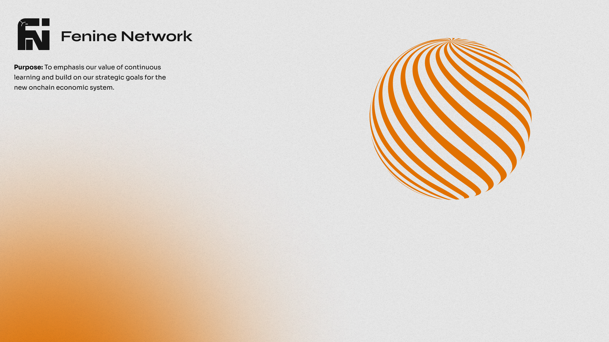

## Introduction

**Fenine Network** is a next-generation **Federated Proof-of-Stake (FPoS)** blockchain platform designed for high performance, security, and true decentralization. With 3-second block times, EVM compatibility, and unique proximity rewards, Fenine empowers developers and users to build the future of Web3.

<Info>
**Network Stats**:
- **Chain ID**: 5881
- **Block Time**: 3 seconds
- **Finality**: 18 seconds
- **TPS**: ~476 for transfers
- **Consensus**: Fenine PoA/FPoS
</Info>



## What Makes Fenine Unique?

<CardGroup cols={3}>
  <Card title="Contract-Layer Validators" icon="file-contract">
    Validators managed via smart contracts, not node software
  </Card>
  
  <Card title="8-Level Proximity Rewards" icon="network-wired">
    Earn from 8 levels of referrals for viral growth
  </Card>
  
  <Card title="Dual Burn Mechanism" icon="fire">
    EIP-1559 burn + deflationary economics
  </Card>
  
  <Card title="3-Second Blocks" icon="bolt">
    Lightning-fast transactions with 18s finality
  </Card>
  
  <Card title="Full EVM Compatibility" icon="code">
    Deploy Ethereum contracts without modifications
  </Card>
  
  <Card title="Ultra-Low Fees" icon="dollar-sign">
    99% cheaper than Ethereum
  </Card>
</CardGroup>

## Getting Started

Choose your path based on your role:

<Tabs>
  <Tab title="Developers">
    ### Build on Fenine
    
    Deploy your dApp on Fenine in minutes:
    
    <Steps>
      <Step title="Add Fenine Network">
        ```javascript
        Network Name: Fenine Network
        RPC URL: https://rpc.fene.app
        Chain ID: 5881
        Currency: FEN
        Explorer: https://explorer.fene.app
        ```
      </Step>
      
      <Step title="Deploy Contracts">
        Use Hardhat, Foundry, or Remix - same as Ethereum!
        
        ```bash
        npx hardhat run scripts/deploy.js --network fenine
        ```
      </Step>
      
      <Step title="Start Building">
        All Ethereum tools work out of the box:
        - ethers.js, web3.js, viem
        - OpenZeppelin contracts
        - The Graph, Moralis, Alchemy
      </Step>
    </Steps>
    
    **Resources**:
    - [Why Build on Fenine](/guides/why-build)
    - [Technical Advantages](/guides/technical-advantages)
    - [Unique Features](/guides/unique-features)
  </Tab>

  <Tab title="Stakers">
    ### Earn Rewards
    
    Stake FEN and earn up to 15% APY:
    
    **Become a Validator**:
    - Stake 10,000+ FEN
    - No special node required
    - Earn block rewards + commission
    
    **Become a Delegator**:
    - Stake 1,000+ FEN
    - Passive income
    - No technical knowledge needed
    
    **Proximity Rewards**:
    - Share referral code
    - Earn from 8 levels
    - Extra 2-5% APY bonus
    
    **Resources**:
    - [Staking Overview](/staking/overview)
    - [Run a Validator](/staking/run-validator)
    - [Become a Delegator](/staking/become-delegator)
    - [Proximity Rewards](/staking/proximity)
  </Tab>

  <Tab title="Node Operators">
    ### Run Infrastructure
    
    Support the network by running a node:
    
    **Non-Validator Node**:
    - Monitor network status
    - Serve RPC requests
    - Independent verification
    
    **RPC Provider**:
    - Enterprise-grade endpoints
    - 99.9% uptime SLA
    - Global CDN distribution
    
    **Private Node**:
    - Closed enterprise integration
    - Compliance support
    - Custom firewall rules
    
    **Resources**:
    - [Node Operators Overview](/node-operators/overview)
    - [Hardware Requirements](/node-operators/hardware-requirements)
    - [Non-Validator Setup](/node-operators/non-validator-setup)
  </Tab>

  <Tab title="Learn">
    ### Deep Dive
    
    Understand Fenine's architecture:
    
    **Core Concepts**:
    - System architecture
    - Consensus mechanism
    - Execution layer
    - FPoS protocol
    
    **Smart Contracts**:
    - FenineSystem contract
    - NFT Passport system
    - RewardManager
    - TaxManager
    
    **Resources**:
    - [Architecture Overview](/architecture/overview)
    - [Consensus](/architecture/consensus)
    - [FPoS Protocol](/architecture/fpos)
    - [API Reference](/api-reference/introduction)
  </Tab>
</Tabs>

## Quick Navigation

<CardGroup cols={4}>
  <Card title="Why Build" icon="rocket" href="/guides/why-build">
    Discover advantages
  </Card>
  
  <Card title="Staking" icon="coins" href="/staking/overview">
    Earn rewards
  </Card>
  
  <Card title="Architecture" icon="building" href="/architecture/overview">
    Technical deep dive
  </Card>
  
  <Card title="API Docs" icon="code" href="/api-reference/introduction">
    RPC & Contracts
  </Card>
  
  <Card title="Run a Node" icon="server" href="/node-operators/overview">
    Infrastructure setup
  </Card>
  
  <Card title="Validators" icon="shield" href="/staking/run-validator">
    Become validator
  </Card>
  
  <Card title="Delegators" icon="hand-holding-dollar" href="/staking/become-delegator">
    Stake & earn
  </Card>
  
  <Card title="Explorer" icon="magnifying-glass" href="https://explorer.fene.app">
    Block explorer
  </Card>
</CardGroup>

## Network Information

<CardGroup cols={2}>
  <Card title="Mainnet RPC" icon="globe">
    ```
    https://rpc.fene.app
    ```
    Chain ID: **5881**
  </Card>
  
  <Card title="Block Explorer" icon="chart-line">
    ```
    https://explorer.fene.app
    ```
    View transactions and contracts
  </Card>
  
  <Card title="Staking Dashboard" icon="chart-pie">
    ```
    https://stake.fene.app
    ```
    Stake, delegate, claim rewards
  </Card>
  
  <Card title="Bridge" icon="bridge">
    ```
    https://bridge.fene.app
    ```
    Cross-chain asset transfers
  </Card>
</CardGroup>

## Key Features

### For Developers

<AccordionGroup>
  <Accordion title="Full EVM Compatibility">
    - Deploy Solidity contracts without changes
    - All Ethereum opcodes supported
    - London hardfork level
    - Works with Hardhat, Foundry, Remix
    - Compatible with ethers.js, web3.js, viem
  </Accordion>

  <Accordion title="High Performance">
    - **3-second block time** (4x faster than Ethereum)
    - **18-second finality** (42x faster)
    - **~476 TPS** for simple transfers
    - **30M gas limit** per block (2x Ethereum)
    - Instant transaction confirmation
  </Accordion>

  <Accordion title="Low Costs">
    - Gas price: **~1 gwei** (vs 50 gwei on Ethereum)
    - Transfer: **$0.00001** (vs $3+ on Ethereum)
    - Swap: **$0.000075** (vs $22+ on Ethereum)
    - 99% cheaper than Ethereum
  </Accordion>

  <Accordion title="Developer Tools">
    - MetaMask, WalletConnect support
    - The Graph indexing
    - Hardhat, Foundry, Truffle
    - OpenZeppelin libraries
    - Alchemy, Moralis SDKs
  </Accordion>
</AccordionGroup>

### For Stakers

<AccordionGroup>
  <Accordion title="Validator Staking">
    - Minimum stake: **10,000 FEN**
    - Managed via smart contract (no node required!)
    - Earn block rewards + commission
    - 10% base APY + proximity rewards
    - No complex infrastructure needed
  </Accordion>

  <Accordion title="Delegation">
    - Minimum: **1,000 FEN**
    - Earn passive income
    - Choose your validator
    - Flexible unbonding (21 days)
    - 8-13% APY (after commission)
  </Accordion>

  <Accordion title="Proximity Rewards">
    - Earn from **8 levels** of referrals
    - 7% from Level 1, 5% from Level 2, etc.
    - Build passive income network
    - Extra 2-5% APY on top of base
    - Automatic distribution every epoch
  </Accordion>

  <Accordion title="Halving Schedule">
    - Block rewards halve every year
    - Initial: 3.5 FEN/block
    - Creates scarcity over time
    - Bitcoin-like deflationary model
    - First halving: January 2026
  </Accordion>
</AccordionGroup>

## Mission & Vision

Fenine Network unites people around shared values and ideology, mining our collective potential to achieve real, lasting impact — forging a society rooted in **justice, transparency, and trust**.

**Our Mission**: Empower individuals and communities to create a more equitable and sustainable future through the power of blockchain technology.

**Core Values**:
- 🌍 **Decentralization**: True power to the community
- 🔒 **Security**: Battle-tested consensus mechanisms
- ⚡ **Performance**: Enterprise-grade throughput
- 💰 **Accessibility**: Low fees, easy onboarding
- 🤝 **Collaboration**: Open-source, transparent governance

## Community & Support

<CardGroup cols={3}>
  <Card title="Discord" icon="discord" href="https://discord.gg/fenines">
    Join our community
  </Card>
  
  <Card title="Twitter/X" icon="twitter" href="https://x.com/feninesnetwork">
    Latest updates
  </Card>
  
  <Card title="GitHub" icon="github" href="https://github.com/fenines-network">
    Open source code
  </Card>
  
  <Card title="Documentation" icon="book" href="/architecture/overview">
    Technical docs
  </Card>
  
  <Card title="Email Support" icon="envelope" href="mailto:support@fene.network">
    Get help
  </Card>
  
  <Card title="Official Links" icon="link" href="/essentials/official-links">
    All resources
  </Card>
</CardGroup>

## Next Steps

<Steps>
  <Step title="Connect Your Wallet">
    Add Fenine Network to MetaMask or your preferred wallet
  </Step>

  <Step title="Get FEN Tokens">
    - Buy on exchanges
    - Bridge from other chains at [bridge.fene.app](https://bridge.fene.app)
    - Use testnet faucet for development
  </Step>

  <Step title="Choose Your Path">
    - **Developers**: Deploy contracts, build dApps
    - **Stakers**: Validate or delegate for rewards
    - **Operators**: Run nodes, support infrastructure
  </Step>

  <Step title="Join Community">
    Connect with other builders and stakers on Discord
  </Step>
</Steps>

<Note>
**Need Help?**

- **Developers**: [#dev-support](https://discord.gg/fenines) on Discord
- **Stakers**: [#staking-support](https://discord.gg/fenines) on Discord
- **Node Operators**: operators@fene.network
- **General**: support@fene.network

Office Hours: Thursdays 3PM UTC
</Note>

---

<div align="center">

**Ready to build?** Start with our [Why Build on Fenine](/guides/why-build) guide.

**Want to stake?** Check out [Staking Overview](/staking/overview).

**Curious about tech?** Dive into [Architecture](/architecture/overview).

</div>
