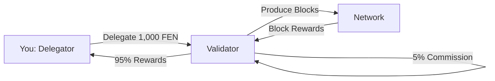

## Introduction

Delegation allows you to earn staking rewards **without running a validator** or technical infrastructure. By delegating your FEN tokens to a validator, you participate in network security and earn a share of rewards.

<Info>
**Quick Facts**:
- **Minimum Delegation**: 100 FEN
- **No Maximum**: Delegate any amount
- **Earn Rewards**: ~8-13% APY (after commission)
- **Unbonding Period**: 21 days to withdraw
- **Risk**: Validator slashing doesn't affect your stake
</Info>

## How Delegation Works



**Process**:
1. Choose a validator (based on commission, uptime, reputation)
2. Delegate your FEN tokens via smart contract
3. Validator uses combined stake to validate blocks
4. Earn proportional share of validator's rewards
5. Claim rewards anytime (10% tax applies)
6. Undelegate anytime (21-day unbonding period)

## Prerequisites

<Tabs>
  <Tab title="FEN Tokens">
    ### Get FEN
    
    **Minimum**: 100 FEN (no maximum)
    
    **Where to Buy**:
    
    1. **Centralized Exchanges**:
       - Check [CoinMarketCap](https://coinmarketcap.com/currencies/fenines/) for listings
       - Withdraw to your personal wallet
    
    2. **Decentralized Exchanges**:
       - FenineSwap (native DEX)
       - Uniswap (if bridged to Ethereum)
       - PancakeSwap (if bridged to BSC)
    
    3. **Bridge from Other Chains**:
       - [bridge.fene.app](https://bridge.fene.app)
       - Support: ETH, BSC, Polygon, Arbitrum
    
    <Warning>
    Always withdraw to **your own wallet**, not exchange wallet. Staking requires full control of your tokens.
    </Warning>
  </Tab>

  <Tab title="Wallet Setup">
    ### Configure Wallet
    
    **Supported Wallets**:
    - MetaMask (most popular)
    - Trust Wallet
    - Coinbase Wallet
    - WalletConnect-compatible wallets
    - Hardware wallets (Ledger, Trezor)
    
    **Add Fenine Network to MetaMask**:
    
    ```javascript
    Network Name: Fenine Network
    RPC URL: https://rpc.fene.app
    Chain ID: 5881
    Currency Symbol: FEN
    Block Explorer: https://explorer.fene.app
    ```
    
    Or click "Add Network" at [chainlist.org](https://chainlist.org/?search=fenine).
    
    **Security Best Practices**:
    - ✅ Back up seed phrase offline
    - ✅ Never share private keys
    - ✅ Use hardware wallet for large amounts
    - ✅ Verify contract addresses before interacting
    - ❌ Don't use exchange wallets for staking
  </Tab>

  <Tab title="Choose Validator">
    ### Validator Selection Criteria
    
    **Key Factors**:
    
    | Factor | What to Check | Why It Matters |
    |--------|---------------|----------------|
    | **Commission** | 1-100% | Lower = more rewards for you |
    | **Uptime** | &gt;99% | High uptime = consistent rewards |
    | **Total Stake** | Not too high | Over-staked validators dilute rewards |
    | **Reputation** | Community feedback | Trust and reliability |
    | **Slashing History** | Zero is best | Past slashes indicate issues |
    
    **Where to Research**:
    - [stake.fene.app/validators](https://stake.fene.app/validators) - Official validator list
    - [explorer.fene.app/validators](https://explorer.fene.app/validators) - On-chain data
    - Discord #validators channel - Community discussion
    - Twitter/X - Validator announcements
    
    <Tip>
    **Diversify**: Consider splitting stake across 2-3 validators to reduce risk.
    </Tip>
  </Tab>
</Tabs>

## Delegation Process

<Steps>
  <Step title="Connect Wallet">
    Visit [stake.fene.app](https://stake.fene.app)
    
    1. Click "Connect Wallet"
    2. Choose your wallet (MetaMask, WalletConnect, etc.)
    3. Approve connection
    4. Ensure you're on Fenine Network (Chain ID: 5881)
    
    **If wrong network**:
    - MetaMask will prompt to switch
    - Or manually select Fenine from network dropdown
  </Step>

  <Step title="Browse Validators">
    Navigate to "Validators" tab
    
    **Sort by**:
    - Commission (lowest first)
    - Total stake (diversify from largest)
    - APY (estimated returns)
    - Your preference
    
    **Validator Card Shows**:
    - Name/description
    - Commission rate (e.g., 5%)
    - Total stake
    - Number of delegators
    - Uptime %
    - Estimated APY
    
    Click validator to see detailed stats.
  </Step>

  <Step title="Delegate Tokens">
    On validator detail page:
    
    1. Click "Delegate" button
    2. Enter amount (minimum 100 FEN)
    3. Optional: Enter referral code for proximity rewards
    4. Review transaction details:
       - Amount: 1,000 FEN
       - Gas fee: ~0.01 FEN
       - Validator: ValidatorName
       - Commission: 5%
    5. Click "Confirm Delegation"
    6. Approve in wallet (gas: ~100,000)
    7. Wait for confirmation (~3 seconds)
    
    **Success!** Your delegation is active immediately and starts earning next epoch (~10 minutes).
  </Step>

  <Step title="Verify Delegation">
    Check your delegation:
    
    **On Dashboard**:
    - Go to "My Delegations" tab
    - See all your delegations
    - View pending rewards
    
    **Via Block Explorer**:
    - Visit [explorer.fene.app](https://explorer.fene.app)
    - Search your address
    - Check "Delegations" tab
    
    **Via RPC**:
    
    ```bash
    curl -X POST https://rpc.fene.app \
      -H "Content-Type: application/json" \
      -d '{
        "jsonrpc": "2.0",
        "method": "eth_getDelegatorInfo",
        "params": ["0xYourAddress"],
        "id": 1
      }'
    ```
  </Step>

  <Step title="Monitor Rewards">
    Track your earnings:
    
    **Dashboard Metrics**:
    - Total delegated: 1,000 FEN
    - Validator: ValidatorName
    - Pending rewards: 2.5 FEN
    - Estimated daily: 0.3 FEN
    - APY: 11%
    
    **Rewards Update**: Every epoch (~10 minutes)
    
    Set up notifications for:
    - Reward milestones
    - Validator jailing
    - Commission changes
  </Step>
</Steps>

## Managing Your Delegation

### View Delegation Status

```javascript
// Using ethers.js
const fenineSystem = new ethers.Contract(
  "0x0000000000000000000000000000000000001000",
  FENINE_SYSTEM_ABI,
  provider
);

// Get your delegation amount
const amount = await fenineSystem.getDelegation(
  yourAddress,
  validatorAddress
);

console.log("Delegated:", ethers.formatEther(amount), "FEN");

// Get pending rewards
const rewards = await fenineSystem.getDelegatorRewards(yourAddress);
console.log("Pending:", ethers.formatEther(rewards), "FEN");
```

### Increase Delegation

Add more tokens to existing delegation:

**Via Interface**:
1. Go to "My Delegations"
2. Find validator
3. Click "Add More"
4. Enter additional amount
5. Confirm transaction

**Via Contract**:

```javascript
const amount = ethers.parseEther("500");  // Add 500 FEN

const tx = await fenineSystem.delegate(
  validatorAddress,
  amount
);

await tx.wait();
console.log("Added 500 FEN to delegation");
```

<Info>
No need to approve again if you already delegated to this validator before.
</Info>

### Claim Rewards

Withdraw accumulated rewards:

**Via Interface**:
1. Go to "My Delegations"
2. Click "Claim Rewards"
3. Review:
   - Claimable: 10 FEN
   - Tax (10%): -1 FEN
   - You receive: 9 FEN
4. Confirm transaction (gas: ~80,000)

**Via Contract**:

```javascript
const tx = await fenineSystem.claimDelegatorRewards();
await tx.wait();

console.log("Rewards claimed!");
```

**Tax Breakdown**:
- 10% tax on claimed rewards
- 5% burned (deflationary)
- 5% to treasury

<Tip>
**Compound Strategy**: Claim weekly and redelegate for higher APY.
</Tip>

### Redelegate to Another Validator

Switch validator without unbonding:

**Via Interface**:
1. Go to "My Delegations"
2. Find current delegation
3. Click "Redelegate"
4. Choose new validator
5. Confirm (instant, no unbonding)

**Via Contract**:

```javascript
const tx = await fenineSystem.redelegate(
  oldValidatorAddress,
  newValidatorAddress,
  amount  // or full amount
);

await tx.wait();
console.log("Redelegated to new validator");
```

<Info>
**Redelegation** is instant and has no unbonding period. Use it to switch validators quickly.
</Info>

### Undelegate (Withdraw)

Remove tokens from delegation:

**Via Interface**:
1. Go to "My Delegations"
2. Click "Undelegate"
3. Enter amount (or click "Max")
4. Confirm transaction
5. Wait 21 days
6. Return to "My Delegations"
7. Click "Withdraw"

**Via Contract**:

```javascript
// Step 1: Start unbonding
const amount = ethers.parseEther("1000");

const tx = await fenineSystem.undelegate(validatorAddress, amount);
await tx.wait();

console.log("Unbonding started. Wait 21 days...");

// Step 2: After 21 days, withdraw
const withdrawTx = await fenineSystem.withdrawUnbonded();
await withdrawTx.wait();

console.log("Tokens withdrawn to wallet!");
```

<Warning>
**Unbonding Period**: 21 days

During unbonding:
- Stop earning rewards immediately
- Cannot cancel unbonding
- Tokens locked until period ends
</Warning>

## Delegation Economics

### Reward Calculation

Your rewards depend on:

$$
R_{\\text{delegator}} = R_{\\text{validator}} \\times \\frac{S_{\\text{your}}}{S_{\\text{total\\_delegated}}} \\times (1 - c)
$$

Where:
- $R_{\\text{validator}}$: Validator's total rewards
- $S_{\\text{your}}$: Your delegation amount
- $S_{\\text{total\\_delegated}}$: Total delegated to validator
- $c$: Validator commission rate

### Example Scenarios

<Tabs>
  <Tab title="Small Delegation">
    **Setup**:
    - Your delegation: 1,000 FEN
    - Validator commission: 5%
    - Validator total stake: 100,000 FEN
    - Network total stake: 10,000,000 FEN
    - Epoch emission: 700 FEN
    
    **Calculation**:
    
    ```
    Validator's rewards per epoch:
      (100,000 / 10,000,000) × 700 = 7 FEN
    
    Your share (before commission):
      (1,000 / 100,000) × 7 = 0.07 FEN
    
    After commission (5%):
      0.07 × 0.95 = 0.0665 FEN per epoch
    
    Daily (144 epochs):
      0.0665 × 144 = 9.58 FEN/day
    
    Monthly:
      9.58 × 30 = 287.4 FEN/month
    
    Annual:
      287.4 × 12 = 3,448.8 FEN/year
    
    APY: (3,448.8 / 1,000) × 100 = 344.88%
    ```
    
    <Info>
    Early delegators earn extremely high APY as network is still small.
    </Info>
  </Tab>

  <Tab title="With Proximity Rewards">
    **Setup**:
    - Base delegation: 1,000 FEN
    - Base rewards: 287.4 FEN/month (28.74% APY)
    - Your referral network:
      - Level 1: 3 people earning 200 FEN/month each
      - Level 2: 2 people earning 150 FEN/month each
    
    **Proximity Calculation**:
    
    ```
    Level 1 rewards:
      3 × 200 × 0.07 = 42 FEN/month
    
    Level 2 rewards:
      2 × 150 × 0.05 = 15 FEN/month
    
    Total proximity bonus:
      42 + 15 = 57 FEN/month
    
    ──────────────────────────────────
    Base rewards:      287.4 FEN/month
    Proximity bonus:    57.0 FEN/month
    ──────────────────────────────────
    Total earnings:    344.4 FEN/month
    
    Effective APY: (344.4 × 12 / 1,000) × 100 = 413%
    ```
    
    See [Proximity Rewards](/staking/proximity) to build your network.
  </Tab>

  <Tab title="Large Delegation">
    **Setup**:
    - Your delegation: 50,000 FEN
    - Validator commission: 10%
    - Validator total: 500,000 FEN
    - Network total: 50,000,000 FEN (mature network)
    
    **Calculation**:
    
    ```
    Validator rewards per epoch:
      (500,000 / 50,000,000) × 700 = 7 FEN
    
    Your share:
      (50,000 / 500,000) × 7 × 0.90 = 0.63 FEN/epoch
    
    Monthly:
      0.63 × 144 × 30 = 2,721.6 FEN
    
    Annual:
      2,721.6 × 12 = 32,659.2 FEN
    
    APY: (32,659.2 / 50,000) × 100 = 65.3%
    ```
    
    As network grows, APY normalizes to sustainable levels.
  </Tab>
</Tabs>

### Comparing Validators

| Validator | Commission | Uptime | Total Stake | Your Share | Est. APY |
|-----------|------------|--------|-------------|------------|----------|
| **A** | 5% | 99.8% | 100K FEN | 1% | 11.2% |
| **B** | 10% | 99.5% | 500K FEN | 0.2% | 10.5% |
| **C** | 3% | 98.0% | 50K FEN | 2% | 10.8% (risky) |
| **D** | 15% | 99.9% | 1M FEN | 0.1% | 9.8% |

**Best Choice**: Validator A (low commission, high uptime, reasonable share)

## Risk Management

### Understanding Risks

<Warning>
**Delegator Risks**:

1. **No Slashing Risk**: If validator is slashed, your stake is safe
2. **Opportunity Cost**: 21-day unbonding locks your tokens
3. **Commission Changes**: Validator can change commission
4. **Validator Jailing**: Stops earning until unjailed
5. **Smart Contract Risk**: Audited but not risk-free
</Warning>

### Risk Mitigation Strategies

<Tabs>
  <Tab title="Diversification">
    **Split Your Stake**:
    
    Instead of:
    ```
    10,000 FEN → Validator A
    ```
    
    Do:
    ```
    3,000 FEN → Validator A (5% commission)
    3,000 FEN → Validator B (7% commission)
    2,000 FEN → Validator C (4% commission)
    2,000 FEN → Validator D (6% commission)
    ```
    
    **Benefits**:
    - Reduce single validator risk
    - Average out commission rates
    - Support decentralization
    - Test multiple validators
  </Tab>

  <Tab title="Active Monitoring">
    **Check Weekly**:
    - ✅ Validator uptime still &gt;99%
    - ✅ Commission hasn't increased
    - ✅ No jailing events
    - ✅ Rewards accumulating as expected
    - ✅ Validator communicating changes
    
    **Red Flags**:
    - 🚩 Uptime drops below 95%
    - 🚩 Multiple jailing events
    - 🚩 Commission increased without notice
    - 🚩 Validator stops communicating
    - 🚩 Large sudden delegations/undelegations
    
    **Action**: Redelegate immediately (no unbonding period)
  </Tab>

  <Tab title="Compounding Strategy">
    **Maximize Returns**:
    
    1. **Claim rewards weekly** (balance between tax and compound frequency)
    2. **Redelegate claimed rewards** (minus tax)
    3. **Build proximity network** (extra income stream)
    4. **Reinvest all profits** (exponential growth)
    
    **Example** (1,000 FEN initial, 10% monthly APY):
    
    | Month | Balance | Rewards | After Tax | Compounded |
    |-------|---------|---------|-----------|------------|
    | 0 | 1,000 | - | - | 1,000 |
    | 1 | 1,000 | 100 | 90 | 1,090 |
    | 2 | 1,090 | 109 | 98 | 1,188 |
    | 3 | 1,188 | 119 | 107 | 1,295 |
    | 6 | 1,715 | 172 | 155 | 1,870 |
    | 12 | 3,138 | 314 | 283 | 3,421 |
    
    **Year 1 ROI**: 242% (vs 120% without compounding)
  </Tab>
</Tabs>

## Advanced Topics

### Batch Operations

Manage multiple delegations efficiently:

```javascript
// Claim rewards from all validators at once
const tx = await fenineSystem.claimAllDelegatorRewards();
await tx.wait();

// Redelegate from multiple validators
const validators = [validatorA, validatorB, validatorC];
const amounts = [
  ethers.parseEther("1000"),
  ethers.parseEther("1500"),
  ethers.parseEther("2000")
];

for (let i = 0; i < validators.length; i++) {
  await fenineSystem.redelegate(
    validators[i],
    newValidator,
    amounts[i]
  );
}
```

### Auto-Compounding

Set up automatic reward reinvestment:

```javascript
// Pseudo-code for automation (requires keeper service)
setInterval(async () => {
  // Check if rewards > threshold
  const rewards = await fenineSystem.getDelegatorRewards(myAddress);
  
  if (rewards > threshold) {
    // Claim rewards
    await fenineSystem.claimDelegatorRewards();
    
    // Wait for transaction
    await delay(5000);
    
    // Redelegate (minus gas buffer)
    const newBalance = await fenToken.balanceOf(myAddress);
    await fenineSystem.delegate(validator, newBalance - gasBuffer);
  }
}, 86400000);  // Check daily
```

<Info>
Coming soon: Built-in auto-compound feature in stake.fene.app
</Info>

### Tax-Efficient Claiming

Minimize tax impact:

**Strategy 1: Infrequent Claims**
- Claim once per month
- Pay tax once (10% of total)
- Lower gas costs

**Strategy 2: Claim and Hold**
- Claim rewards to wallet
- Hold for appreciation
- Redelegate only profitable amounts

**Strategy 3: Proximity Offset**
- Build large proximity network
- Use proximity rewards to offset tax
- Keep base rewards compounding

## Troubleshooting

<AccordionGroup>
  <Accordion title="Delegation transaction failed">
    **Common Issues**:
    
    1. **Insufficient FEN for gas**
       - Need ~0.01 FEN for transaction
       - Get more from DEX or faucet
    
    2. **Validator not accepting delegations**
       - Check validator status (jailed?)
       - Try different validator
    
    3. **Amount below minimum**
       - Must be ≥100 FEN
       - Check token decimals (18)
    
    4. **Wrong network**
       - Switch to Fenine Network (Chain ID: 5881)
       - Check RPC: https://rpc.fene.app
  </Accordion>

  <Accordion title="Not earning rewards">
    **Check**:
    
    1. **Validator active?**
       ```bash
       curl -X POST https://rpc.fene.app \
         -d '{"jsonrpc":"2.0","method":"eth_getValidatorInfo","params":["validatorAddress"],"id":1}'
       ```
       Status should be 1 (Active), not 0/2/3
    
    2. **Waited for first epoch?**
       - Rewards start next epoch (~10 min)
       - Check again after 15 minutes
    
    3. **Delegation confirmed?**
       - Check on explorer.fene.app
       - View transaction receipt
    
    4. **Validator commission 100%?**
       - Check validator page
       - If 100%, you get nothing (avoid!)
  </Accordion>

  <Accordion title="Rewards lower than estimated">
    **Possible Reasons**:
    
    - Network stake increased (more competition)
    - Validator was jailed briefly
    - Commission rate changed
    - Epoch emissions decreased
    - Calculator used wrong parameters
    
    **Verify**:
    ```javascript
    const rewards = await fenineSystem.getDelegatorRewards(yourAddress);
    const totalStake = await fenineSystem.getTotalStake();
    const validatorStake = await fenineSystem.getValidatorStake(validator);
    
    console.log("Your rewards:", ethers.formatEther(rewards));
    console.log("Network share:", (validatorStake / totalStake * 100).toFixed(4), "%");
    ```
  </Accordion>

  <Accordion title="Can't withdraw after 21 days">
    **Troubleshoot**:
    
    1. **Call withdrawUnbonded()**
       - Unbonding doesn't auto-withdraw
       - Must manually call withdraw function
    
    2. **Check unbonding complete**
       ```javascript
       const unbonding = await fenineSystem.getUnbondingDelegation(yourAddress);
       console.log("Completion block:", unbonding.completionBlock);
       
       const currentBlock = await provider.getBlockNumber();
       console.log("Current block:", currentBlock);
       
       if (currentBlock >= unbonding.completionBlock) {
         await fenineSystem.withdrawUnbonded();
       }
       ```
    
    3. **Multiple unbonding entries**
       - Can only withdraw oldest first
       - Check all unbonding delegations
  </Accordion>
</AccordionGroup>

## Next Steps

<CardGroup cols={2}>
  <Card title="Stake Now" icon="rocket" href="https://stake.fene.app">
    Start earning rewards
  </Card>
  
  <Card title="Proximity Rewards" icon="network-wired" href="/staking/proximity">
    Boost APY with referrals
  </Card>
  
  <Card title="Run a Validator" icon="server" href="/staking/run-validator">
    Become a validator instead
  </Card>
  
  <Card title="FenineSystem API" icon="code" href="/api-reference/contracts/fenine-system">
    Technical contract reference
  </Card>
</CardGroup>

<Note>
**Delegator Support**:
- Discord: [#delegator-help](https://discord.gg/fenines)
- Email: staking@fene.network
- FAQ: [stake.fene.app/faq](https://stake.fene.app/faq)
- Tutorial Videos: [YouTube Channel](https://youtube.com/@feninesnetwork)

Join our community of 10,000+ delegators!
</Note>
