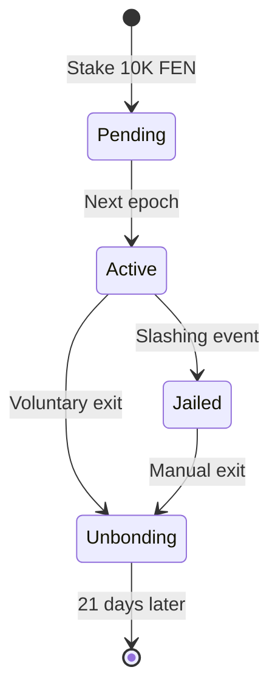

## Introduction

Fenine Network implements a unique **Federated Proof-of-Stake (FPoS)** consensus mechanism that combines validator staking with an innovative 8-level proximity reward system. This creates powerful economic incentives for network growth and decentralization.

<Info>
**Quick Facts**:
- Minimum Validator Stake: **10,000 FEN**
- Minimum Delegation: **1,000 FEN**
- Base APY: **10%**
- Proximity Bonus: **Up to 12-15% total APY**
- Epoch Duration: **200 blocks** (~10 minutes)
</Info>

## How Staking Works

<Tabs>
  <Tab title="For Validators">
    ### Become a Validator
    
    **Requirements**:
    1. Stake minimum 10,000 FEN tokens
    2. Register through FenineSystem contract
    3. Provide commission rate (1-100%)
    
    **Responsibilities**:
    - Propose and validate blocks
    - Maintain high uptime (&gt;95%)
    - Act honestly (subject to slashing)
    
    **Rewards**:
    - Block rewards: 3.5 FEN per block
    - Transaction fees (priority fees)
    - Commission from delegators
    - Proximity rewards from referrals
    
    **Example Monthly Earnings** (10,000 FEN staked):
    ```
    Base rewards:      ~83 FEN/month (10% APY)
    Commission (10%):  ~8 FEN from delegators
    Proximity bonus:   ~17 FEN (2% from network)
    ───────────────────────────────────────────
    Total:             ~108 FEN/month (13% APY)
    ```
  </Tab>

  <Tab title="For Delegators">
    ### Become a Delegator
    
    **Requirements**:
    1. Minimum 1,000 FEN tokens
    2. Choose a validator to delegate to
    3. Optional: Use referral code for proximity rewards
    
    **Benefits**:
    - Earn staking rewards without running infrastructure
    - Share in validator's block rewards
    - Participate in proximity reward network
    - Flexible: Undelegate anytime (21-day unbonding)
    
    **Rewards**:
    - Base APY: 10% (minus validator commission)
    - Proximity rewards from your referrals
    - No technical knowledge required
    
    **Example Monthly Earnings** (1,000 FEN delegated):
    ```
    Base rewards:      ~8.3 FEN/month (10% APY)
    - Commission 5%:   -0.4 FEN
    Proximity bonus:   ~1.7 FEN (2% from referrals)
    ───────────────────────────────────────────
    Net earnings:      ~9.6 FEN/month (11.5% APY)
    ```
  </Tab>

  <Tab title="Proximity System">
    ### 8-Level Referral Network
    
    Fenine's unique feature: earn rewards from **8 levels** of referrals.
    
    **How it Works**:
    
    ```
    You (Level 0)
    ├─ Direct Referrals (Level 1): Earn 7% of their rewards
    │  └─ Their Referrals (Level 2): Earn 5% of their rewards
    │     └─ Level 3: Earn 3%
    │        └─ Level 4: Earn 2%
    │           └─ Level 5: Earn 1.5%
    │              └─ Level 6: Earn 1%
    │                 └─ Level 7: Earn 0.5%
    │                    └─ Level 8: Earn 0.25%
    ```
    
    **Total Possible APY**: 10% base + up to 5% proximity = **15% APY**
    
    See [Proximity Rewards](/staking/proximity) for details.
  </Tab>
</Tabs>

## Staking Architecture

### Contract-Layer Validators

<Warning>
**Important**: Fenine uses **contract-layer validators**, not traditional node-layer validators.

Validator management happens entirely through the **FenineSystem** smart contract at `0x0000000000000000000000000000000000001000`.

You do **NOT** need to run special validator node software. Block production and consensus happen automatically once you register as a validator.
</Warning>

### System Components

<CardGroup cols={3}>
  <Card title="FenineSystem" icon="gears">
    Core validator registry, staking logic, epoch management
  </Card>
  
  <Card title="RewardManager" icon="gift">
    Reward calculation, distribution, proximity tree
  </Card>
  
  <Card title="TaxManager" icon="receipt">
    Reward taxation (10%), burn mechanism
  </Card>
</CardGroup>

### Validator Lifecycle



**State Descriptions**:

| State | Description | Can Validate? | Can Unstake? |
|-------|-------------|---------------|--------------|
| **Pending** | Registered, waiting for next epoch | ❌ | ✅ (no delay) |
| **Active** | Participating in consensus | ✅ | ✅ (21-day delay) |
| **Jailed** | Penalized for misbehavior | ❌ | ✅ (21-day delay) |
| **Unbonding** | Waiting for unstake period | ❌ | ⏳ (counting down) |
| **Exited** | Fully unstaked | ❌ | ✅ (can restake) |

## Reward Distribution

### Emission Schedule

**Annual Issuance**: 10,520,000 FEN (~10.52% of max supply)

$$
E_{\\text{annual}} = 10,520,000 \\text{ FEN}
$$

**Block Reward**: 3.5 FEN per block

$$
R_{\\text{block}} = 3.5 \\text{ FEN}
$$

**Daily Emissions**: ~28,800 blocks/day

$$
E_{\\text{daily}} = \\frac{86,400}{3} \\times 3.5 \\approx 100,800 \\text{ FEN/day}
$$

### Reward Formula

For a validator with stake $S_v$ and delegated stake $S_d$:

$$
R_{\\text{validator}} = R_{\\text{base}} + R_{\\text{commission}} + R_{\\text{proximity}}
$$

Where:

- $R_{\\text{base}} = \\frac{S_v}{S_{\\text{total}}} \\times E_{\\text{epoch}}$
- $R_{\\text{commission}} = \\frac{S_d}{S_{\\text{total}}} \\times E_{\\text{epoch}} \\times c$
- $R_{\\text{proximity}} = \\sum_{i=1}^{8} \\sum_{j \\in L_i} R_j \\times \\alpha_i$

**Parameters**:
- $S_{\\text{total}}$: Total network stake
- $E_{\\text{epoch}}$: Epoch emission (700 FEN)
- $c$: Validator commission rate (e.g., 0.05 = 5%)
- $\\alpha_i$: Proximity coefficient for level $i$

<Accordion title="Example Calculation">
**Scenario**:
- Your stake: 10,000 FEN
- Delegated to you: 50,000 FEN
- Total network stake: 10,000,000 FEN
- Your commission: 10%
- Epoch emission: 700 FEN

**Base Rewards**:

$$
R_{\\text{base}} = \\frac{10,000}{10,000,000} \\times 700 = 0.7 \\text{ FEN}
$$

**Commission Rewards**:

$$
R_{\\text{commission}} = \\frac{50,000}{10,000,000} \\times 700 \\times 0.10 = 0.35 \\text{ FEN}
$$

**Total per Epoch**: 1.05 FEN (~144 epochs/day = 151 FEN/day)

**Monthly**: ~4,530 FEN (~54% APY on 10K stake)
</Accordion>

## Economic Model

### Dual Burn Mechanism

Fenine implements two deflationary mechanisms:

<AccordionGroup>
  <Accordion title="1. EIP-1559 Base Fee Burn">
    Every transaction burns the base fee:
    
    $$
    B_{\\text{1559}} = \\text{BaseFee} \\times G_{\\text{used}}
    $$
    
    **Annual Burn** (at 10 gwei average):
    
    $$
    B_{\\text{annual}} \\approx 1,580,000 \\text{ FEN}
    $$
    
    This is ~15% of annual emissions.
  </Accordion>

  <Accordion title="2. Transaction Fee Taxation">
    When claiming staking rewards:
    
    - 10% tax on claimed rewards
    - Tax goes to treasury for development and ecosystem growth
    
    **Note**: This tax does NOT reduce circulating supply. Only EIP-1559 base fee burn is deflationary.
  </Accordion>

  <Accordion title="Net Inflation">
    **Supply Dynamics**:
    
    $$
    \\Delta S = E_{\\text{annual}} - B_{\\text{1559}}
    $$
    
    **Scenarios**:
    
    | Network Activity | Base Fee | EIP-1559 Burn | Net Inflation |
    |------------------|----------|---------------|---------------|
    | Low | 1 gwei | 158K FEN | +10.36M (+10.36%) |
    | Medium | 10 gwei | 1.58M FEN | +8.94M (+8.94%) |
    | **High** | **67 gwei** | **10.6M FEN** | **-80K (-0.08%)** |
    | Very High | 100 gwei | 15.8M FEN | -5.28M (-5.28%) |
    
    <Info>
    Network becomes **deflationary** at 67 gwei average base fee.
    </Info>
  </Accordion>
</AccordionGroup>

## Risk Factors

<Warning>
**Understand the Risks**:

1. **Slashing**: Validators can lose stake for misbehavior (double-signing, downtime)
2. **Unbonding Period**: 21 days to withdraw after unstaking
3. **Commission Changes**: Validators can change commission rates
4. **Smart Contract Risk**: Staking happens via smart contracts
5. **Market Risk**: FEN price volatility affects USD value of rewards
</Warning>

### Slashing Conditions

| Offense | Penalty | Description |
|---------|---------|-------------|
| **Double-Sign** | 5% slash | Signing two blocks at same height |
| **Downtime** | Jailed | &lt;95% uptime over 200 blocks |
| **Invalid Block** | 1% slash | Proposing invalid block |
| **Censorship** | Warning → Jail | Consistently ignoring valid transactions |

Slashed funds are burned, reducing total supply.

## Getting Started

<Steps>
  <Step title="Choose Your Path">
    **Validator** or **Delegator**?
    
    - Have 10,000+ FEN + technical skills → Validator
    - Have 100+ FEN, want passive income → Delegator
  </Step>

  <Step title="Get FEN Tokens">
    - Buy on exchanges (CEX/DEX)
    - Bridge from other chains
    - Minimum: 10,000 FEN (validator) or 100 FEN (delegator)
  </Step>

  <Step title="Set Up Wallet">
    - MetaMask, Trust Wallet, or hardware wallet
    - Add Fenine Network (Chain ID: 5881)
    - Secure your private keys
  </Step>

  <Step title="Stake Your FEN">
    **Validators**: See [Run a Validator](/staking/run-validator)
    
    **Delegators**: See [Become a Delegator](/staking/become-delegator)
  </Step>

  <Step title="Earn Rewards">
    - Claim rewards via stake.fene.app
    - Compound for higher APY
    - Share referral code for proximity rewards
  </Step>
</Steps>

## Staking Options Comparison

| Feature | Validator | Delegator |
|---------|-----------|-----------|
| **Minimum Stake** | 10,000 FEN | 100 FEN |
| **Technical Skills** | Required | Not required |
| **Infrastructure** | Optional (contract-layer) | None |
| **Base APY** | 10% | 10% (minus commission) |
| **Additional Rewards** | Commission + Proximity | Proximity only |
| **Slashing Risk** | Yes | No (validator slashed, not you) |
| **Governance** | Full voting power | Proportional to stake |
| **Unbonding Period** | 21 days | 21 days |

## Frequently Asked Questions

<AccordionGroup>
  <Accordion title="Do I need to run a node to be a validator?">
    **No!** Fenine uses contract-layer validators. You only need to:
    
    1. Stake 10,000 FEN via smart contract
    2. Register your validator address
    3. Set your commission rate
    
    The protocol automatically includes you in block production. You CAN run a node for RPC access or network monitoring, but it's not required for validation.
  </Accordion>

  <Accordion title="What happens if my delegated validator gets slashed?">
    **Delegator Protection**: If your validator is slashed, only the validator's stake is penalized, not yours.
    
    However:
    - Validator may be jailed (stop earning)
    - You may want to redelegate to active validator
    - No unbonding period when redelegating
  </Accordion>

  <Accordion title="Can I stake from a hardware wallet?">
    **Yes!** Staking works with:
    
    - Ledger (via MetaMask connection)
    - Trezor (via MetaMask connection)
    - Any wallet supporting custom EVM chains
    
    For maximum security, use hardware wallet for staking.
  </Accordion>

  <Accordion title="How do I maximize my APY?">
    **Strategies**:
    
    1. **Auto-compound**: Claim and restake rewards weekly
    2. **Build proximity network**: Share referral code
    3. **Choose low-commission validator**: More rewards for you
    4. **Stake early**: APY decreases as network grows
    5. **Become validator**: Earn commission from delegators
    
    Realistic range: **10-15% APY** with active participation.
  </Accordion>

  <Accordion title="What is the unbonding period?">
    **21 days** for both validators and delegators.
    
    When you unstake:
    1. Tokens enter "unbonding" state
    2. Stop earning rewards immediately
    3. After 21 days, can withdraw to wallet
    
    **Why?** Security measure to prevent rapid unstaking during attacks.
  </Accordion>

  <Accordion title="Can I lose my staked FEN?">
    **Validators**: Yes, via slashing for misbehavior.
    
    **Delegators**: No slashing risk directly, but:
    - Smart contract risk (audited but not zero)
    - Market risk (FEN price volatility)
    - Opportunity cost (locked for 21 days if unbonding)
    
    Always stake amounts you can afford to lock up.
  </Accordion>
</AccordionGroup>

## Resources

<CardGroup cols={2}>
  <Card title="Stake Now" icon="hand-holding-dollar" href="https://stake.fene.app">
    Official staking interface
  </Card>
  
  <Card title="Run a Validator" icon="server" href="/staking/run-validator">
    Complete validator setup guide
  </Card>
  
  <Card title="Become a Delegator" icon="users" href="/staking/become-delegator">
    Delegation tutorial
  </Card>
  
  <Card title="Proximity Rewards" icon="network-wired" href="/staking/proximity">
    Referral system explained
  </Card>
  
  <Card title="FPoS Architecture" icon="building" href="/architecture/fpos">
    Technical deep dive
  </Card>
  
  <Card title="FenineSystem Contract" icon="file-contract" href="/api-reference/contracts/fenine-system">
    Smart contract API reference
  </Card>
</CardGroup>

<Note>
**Need Help?**

- Discord: [#staking-support](https://discord.gg/fenines)
- Email: staking@fene.network
- Staking Dashboard: [stake.fene.app](https://stake.fene.app)

Validator Office Hours: Fridays 2PM UTC
</Note>
