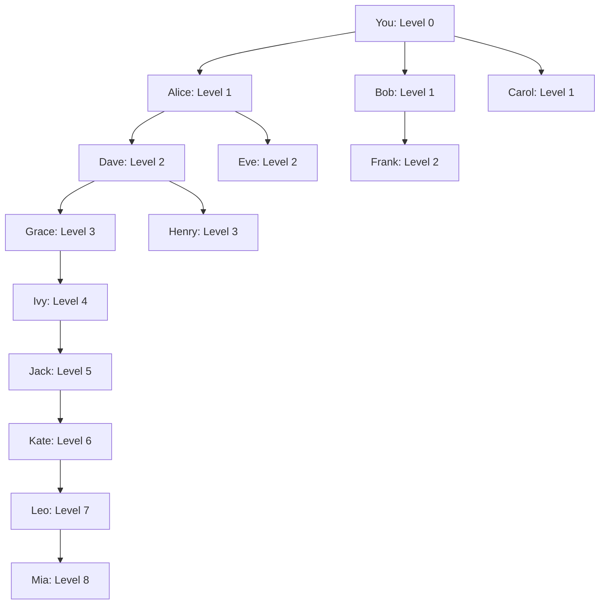

## Introduction

Fenine's **Proximity Reward System** is a unique 8-level referral mechanism that allows you to earn passive income from your network's staking activity. This creates powerful viral growth incentives while rewarding early participants.

<Info>
**Key Benefits**:
- **Earn from 8 levels** of referrals
- **Up to 5% bonus APY** on top of base staking
- **Automatic distribution** every epoch
- **No claiming needed** for proximity rewards
- **Build once, earn forever** from active network
</Info>

## How Proximity Works

### The 8-Level Tree

When someone stakes using your referral code, they become your **Level 1** referral. When they refer someone, that person becomes your **Level 2** referral, and so on.



**You earn a percentage of rewards from all 8 levels!**

### Reward Distribution Rates

| Level | Relationship | Reward Share | If They Earn 100 FEN |
|-------|--------------|--------------|---------------------|
| **1** | Your direct referrals | **7%** | You earn 7 FEN |
| **2** | Their referrals | **5%** | You earn 5 FEN |
| **3** | 2nd generation | **3%** | You earn 3 FEN |
| **4** | 3rd generation | **2%** | You earn 2 FEN |
| **5** | 4th generation | **1.5%** | You earn 1.5 FEN |
| **6** | 5th generation | **1%** | You earn 1 FEN |
| **7** | 6th generation | **0.5%** | You earn 0.5 FEN |
| **8** | 7th generation | **0.25%** | You earn 0.25 FEN |

**Total**: Up to **20.25%** of one person's rewards if you have all 8 levels active.

### Mathematical Model

For a user $u$ with referral tree $T_u$, proximity rewards per epoch:

$$
R_{\\text{proximity}}(u) = \\sum_{i=1}^{8} \\sum_{j \\in L_i(u)} R_j \\times \\alpha_i
$$

Where:
- $L_i(u)$: Set of users at level $i$ referred by $u$
- $R_j$: Base staking rewards earned by user $j$ in this epoch
- $\\alpha_i$: Proximity coefficient for level $i$

**Coefficients**:

- $\\alpha_1 = 0.07$ (Level 1)
- $\\alpha_2 = 0.05$ (Level 2)
- $\\alpha_3 = 0.03$ (Level 3)
- $\\alpha_4 = 0.02$ (Level 4)
- $\\alpha_5 = 0.015$ (Level 5)
- $\\alpha_6 = 0.01$ (Level 6)
- $\\alpha_7 = 0.005$ (Level 7)
- $\\alpha_8 = 0.0025$ (Level 8)

## Getting Your Referral Code

### Automatic Generation

When you first stake or delegate, a unique referral code is automatically created:

**Via stake.fene.app**:
1. Connect wallet
2. Stake or delegate any amount
3. Go to "Referrals" tab
4. Your code is displayed

**Format**: 6-character alphanumeric (e.g., `XYZ123`)

### Via Smart Contract

```javascript
const fenineSystem = new ethers.Contract(
  "0x0000000000000000000000000000000000001000",
  FENINE_SYSTEM_ABI,
  signer
);

// Get your referral code
const myCode = await fenineSystem.getReferralCode(myAddress);
console.log("Your code:", myCode);

// If no code exists (not staked yet), will return empty string
```

### Setting Referrer (Using Someone's Code)

When you stake for the first time, use a referral code:

**Via Interface**:
1. On delegation page
2. Click "I have a referral code"
3. Enter code (e.g., `ABC123`)
4. Complete delegation
5. You're now in their proximity tree!

**Via Contract**:

```javascript
// Delegate with referral
const tx = await fenineSystem.delegateWithReferral(
  validatorAddress,
  amount,
  "ABC123"  // Referrer's code
);

await tx.wait();
```

<Warning>
**Important**: Referral code can only be set **once** during first stake/delegation. Cannot be changed later!
</Warning>

## Building Your Network

### Sharing Strategies

<Tabs>
  <Tab title="Social Media">
    **Twitter/X**:
    ```
    💎 Stake FEN and earn up to 15% APY!
    
    Use my code: XYZ123
    
    ✅ 10% base APY
    ✅ +5% proximity bonus
    ✅ 8 levels deep
    
    👉 https://stake.fene.app?ref=XYZ123
    
    #Fenine #DeFi #Staking
    ```
    
    **Instagram/TikTok**:
    - Create tutorial video
    - Show your earnings dashboard
    - Explain proximity system visually
    - Include code in bio/description
    
    **YouTube**:
    - "How I Earn 15% APY on Fenine"
    - "Passive Income with FEN Staking"
    - "Proximity Rewards Explained"
    - Code in video description
  </Tab>

  <Tab title="Content Marketing">
    **Blog Post Ideas**:
    - "Complete Guide to Fenine Staking"
    - "My First Month Staking FEN: Results"
    - "How to Maximize Staking APY"
    - "Fenine vs Other DeFi Protocols"
    
    **Medium/Substack**:
    - Write detailed guides
    - Share monthly earnings reports
    - Compare with other platforms
    - Include referral code naturally
    
    **Reddit**:
    - Participate in crypto subreddits
    - Answer questions about FEN
    - Share insights, not just code
    - Follow subreddit rules (no spam)
  </Tab>

  <Tab title="Community Building">
    **Discord Server**:
    ```
    📢 Fenine Staking Community
    
    - Daily updates
    - APY tracking
    - Strategy discussions
    - Support chat
    
    Use code XYZ123 when joining!
    ```
    
    **Telegram Group**:
    - Create staking discussion group
    - Share market analysis
    - Post reward screenshots
    - Help newcomers
    
    **Local Meetups**:
    - Organize crypto meetups
    - Present Fenine staking
    - Demo stake.fene.app
    - Share codes in person
  </Tab>

  <Tab title="Educational Content">
    **Video Tutorials**:
    1. "Setting Up MetaMask for Fenine"
    2. "How to Delegate FEN Tokens"
    3. "Understanding Proximity Rewards"
    4. "Claiming and Compounding Rewards"
    
    **Written Guides**:
    - Step-by-step screenshots
    - Common troubleshooting
    - Best practices
    - Safety tips
    
    **Infographics**:
    - Proximity tree visualization
    - APY comparison charts
    - Earnings projections
    - Share on Pinterest/Instagram
  </Tab>
</Tabs>

### Tracking Your Referrals

**Dashboard Metrics**:

```
My Referral Network
──────────────────────────────────────
Total Referrals:        47 people
Active Stakers:         39 people
Total Staked:           234,567 FEN
My Proximity Rewards:   1,234 FEN (lifetime)

Breakdown by Level:
Level 1:  12 people  →  94.5 FEN earned
Level 2:  18 people  →  67.2 FEN earned
Level 3:  10 people  →  38.4 FEN earned
Level 4:   4 people  →  15.6 FEN earned
Level 5:   2 people  →   8.3 FEN earned
Level 6:   1 person  →   2.1 FEN earned
Level 7:   0 people  →   0.0 FEN earned
Level 8:   0 people  →   0.0 FEN earned
```

**Via Contract**:

```javascript
// Get referral tree
const tree = await fenineSystem.getReferralTree(myAddress);

console.log("Level 1:", tree.level1.length, "people");
console.log("Level 2:", tree.level2.length, "people");
// ... up to level 8

// Get proximity rewards earned
const rewards = await fenineSystem.getProximityRewards(myAddress);
console.log("Lifetime proximity:", ethers.formatEther(rewards));
```

## Earnings Examples

### Small Network

**Setup**:
- Level 1: 5 people, avg 1,000 FEN each
- Level 2: 3 people, avg 800 FEN each
- All earning 10% base APY

**Monthly Calculation**:

```
Level 1 rewards:
  5 × 1,000 × 0.10/12 × 0.07 = 2.92 FEN/month

Level 2 rewards:
  3 × 800 × 0.10/12 × 0.05 = 1.00 FEN/month

──────────────────────────────────────
Total proximity: 3.92 FEN/month

If your stake is 1,000 FEN:
  Base: 8.33 FEN/month (10% APY)
  Proximity: 3.92 FEN/month
  Total: 12.25 FEN/month

Effective APY: 14.7%
```

### Medium Network

**Setup**:
- Level 1: 20 people, avg 2,000 FEN
- Level 2: 40 people, avg 1,500 FEN
- Level 3: 30 people, avg 1,000 FEN
- Level 4: 15 people, avg 800 FEN

**Monthly Calculation**:

```
L1: 20 × 2,000 × 0.10/12 × 0.07 =  23.33 FEN
L2: 40 × 1,500 × 0.10/12 × 0.05 =  25.00 FEN
L3: 30 × 1,000 × 0.10/12 × 0.03 =   7.50 FEN
L4: 15 × 800  × 0.10/12 × 0.02 =   2.00 FEN
──────────────────────────────────────
Total proximity: 57.83 FEN/month

With 5,000 FEN stake:
  Base: 41.67 FEN/month
  Proximity: 57.83 FEN/month
  Total: 99.50 FEN/month

Effective APY: 23.9%
```

### Large Network

**Setup**:
- Levels 1-8 fully populated
- Total network: 500+ people
- Combined stake: 1,000,000 FEN

**Monthly Projection**:

```
Estimated proximity rewards: 400+ FEN/month

With 10,000 FEN stake:
  Base: 83.33 FEN/month
  Proximity: 400 FEN/month
  Total: 483.33 FEN/month

Effective APY: 58%!
```

<Info>
**Reality Check**: Building a large network takes time and effort. Most users earn 2-5% additional APY from proximity.
</Info>

## Advanced Strategies

### Compound Growth Network

**Strategy**: Teach referrals to refer others.

```
You stake 10,000 FEN
│
├─ Level 1 (10 people): Teach them to share
│  │
│  ├─ Level 2 (30 people): Each L1 refers 3 people
│     │
│     ├─ Level 3 (90 people): Each L2 refers 3 people
│        │
│        └─ And so on...
```

**Keys to Success**:
1. Provide referral materials (templates, graphics)
2. Educate on proximity benefits
3. Track top performers
4. Reward top referrers (giveaways, recognition)
5. Build community (Discord, Telegram)

### Targeted Outreach

**High-Value Targets**:
- Crypto influencers
- DeFi protocol founders
- DAO communities
- Investment groups
- Trading communities

**Pitch**:
```
"Unlike typical referral programs:
• Earn from 8 levels (not just 1-2)
• Passive income forever
• Your network compounds
• Built into blockchain protocol
• Transparent on-chain tracking"
```

### Content Funnel

```
Awareness Stage:
└─ Twitter threads about DeFi APY

Interest Stage:
└─ "Fenine vs Other Staking" blog post

Consideration Stage:
└─ YouTube tutorial with earnings proof

Conversion Stage:
└─ Email list with referral code
   └─ Drip campaign teaching how to stake

Retention Stage:
└─ Monthly earnings newsletter
   └─ Encourage them to refer
```

### Incentive Programs

**Run Your Own Bonuses**:

```
🎁 My Referral Bonus Program

Use code XYZ123 and stake 1,000+ FEN:

• 1st month: I'll send you 50 FEN bonus
• 3rd month: Another 50 FEN if still staked
• 6th month: 100 FEN bonus

+ Exclusive Discord access
+ Weekly market analysis
+ 1-on-1 onboarding call
```

Fund bonuses from your proximity earnings.

## Proximity Economics

### Network Value Formula

The lifetime value (LTV) of one referral:

$$
\\text{LTV} = S \\times r \\times \\alpha_1 \\times d
$$

Where:
- $S$: Referral's stake amount
- $r$: Annual staking rewards rate (10%)
- $\\alpha_1$: Level 1 coefficient (0.07)
- $d$: Average staking duration (years)

**Example**:
- Referral stakes 2,000 FEN
- Stays staked 2 years

$$
\\text{LTV} = 2,000 \\times 0.10 \\times 0.07 \\times 2 = 28 \\text{ FEN}
$$

If they refer 3 more people (Level 2 for you):

$$
\\text{LTV}_{\\text{total}} = 28 + (3 \\times 2,000 \\times 0.10 \\times 0.05 \\times 2) = 88 \\text{ FEN}
$$

**ROI on Referral Effort**: Potentially very high!

### Optimal Network Structure

**Goal**: Maximize depth, not just width.

**Bad Structure** (wide, shallow):
```
You
├─ 100 Level 1 referrals
└─ 0 Level 2+ referrals

Earnings: Only 7% of their rewards
```

**Good Structure** (deep, balanced):
```
You
├─ 20 Level 1
│  ├─ 40 Level 2
│     ├─ 60 Level 3
│        ├─ 40 Level 4
│           └─ ... levels 5-8

Earnings: 20.25% across all levels
```

**How to Build Depth**:
1. Incentivize referrals to recruit
2. Provide training and materials
3. Track and reward top recruiters
4. Create competitive leaderboard
5. Share success stories

## Smart Contract Integration

### Check Referral Relationship

```javascript
// Check who referred you
const myReferrer = await fenineSystem.getReferrer(myAddress);
console.log("Referred by:", myReferrer);

// Check if someone used your code
const theirReferrer = await fenineSystem.getReferrer(theirAddress);
if (theirReferrer === myAddress) {
  console.log("They're in your Level 1!");
}
```

### Calculate Proximity Rewards

```javascript
// Get proximity rewards breakdown
const breakdown = await fenineSystem.getProximityBreakdown(myAddress);

console.log("Level 1 rewards:", ethers.formatEther(breakdown.level1));
console.log("Level 2 rewards:", ethers.formatEther(breakdown.level2));
// ... up to level 8

// Total proximity rewards
const total = await fenineSystem.getProximityRewards(myAddress);
console.log("Total earned:", ethers.formatEther(total));
```

### Monitor Network Growth

```javascript
// Get referral count by level
const counts = await fenineSystem.getReferralCounts(myAddress);

console.log("My Network:");
for (let i = 1; i <= 8; i++) {
  console.log(`  Level ${i}: ${counts[i-1]} people`);
}

// Get total staked in your network
const networkStake = await fenineSystem.getNetworkStake(myAddress);
console.log("Total network stake:", ethers.formatEther(networkStake));
```

## Frequently Asked Questions

<AccordionGroup>
  <Accordion title="Can I change my referrer?">
    **No.** Referral relationship is set **once** during first stake/delegation and cannot be changed.
    
    This prevents:
    - Gaming the system
    - Circular referrals
    - Network manipulation
    
    Choose your referrer carefully when starting!
  </Accordion>

  <Accordion title="Do proximity rewards get taxed?">
    **No!** Only when you claim your **base staking rewards**, the 10% tax applies.
    
    Proximity rewards:
    - Automatically distributed to your wallet
    - No tax on receipt
    - Can use immediately or restake
    - Only taxed if you later stake them and claim
  </Accordion>

  <Accordion title="What if someone in my tree unstakes?">
    You stop earning from them immediately. Their position in your tree remains (for tracking), but they don't generate rewards for you anymore.
    
    If they re-stake later, you resume earning from them.
  </Accordion>

  <Accordion title="How many people can be in Level 1?">
    **Unlimited!** There's no cap on referrals at any level.
    
    Your network can grow infinitely across all 8 levels.
  </Accordion>

  <Accordion title="Can I see who's in my network?">
    **Privacy:** Full addresses are not publicly visible by default.
    
    Via contract:
    - You can see count per level
    - Total stake per level
    - Rewards earned per level
    
    Referrals can choose to reveal themselves to you.
  </Accordion>

  <Accordion title="Is this a pyramid scheme?">
    **No!** Key differences:
    
    | Pyramid Scheme | Fenine Proximity |
    |----------------|------------------|
    | Recruitment required | Optional, rewards exist without it |
    | Money flows up | Rewards from protocol, not users |
    | Unsustainable | Funded by block emissions |
    | Early joiners drain late | Everyone earns proportionally |
    | Eventual collapse | Sustainable economics |
    
    Proximity is **network effect monetization**, not a pyramid.
  </Accordion>

  <Accordion title="What happens at Level 9+?">
    **Nothing.** The tree stops at Level 8.
    
    Level 9 and beyond don't generate proximity rewards for you. However, they still generate rewards for levels 1-8 above them.
  </Accordion>
</AccordionGroup>

## Tools & Resources

### Tracking Dashboard

Visit [stake.fene.app/referrals](https://stake.fene.app/referrals):

- Real-time network visualization
- Earnings breakdown by level
- Referral code generator
- Sharing tools (Twitter, Email, Link)
- Performance leaderboard
- Promotional materials

### Marketing Materials

**Download Free Assets**:
- Banner images (Twitter, Discord, Telegram)
- Infographics (proximity tree, APY comparison)
- Video templates (staking tutorial)
- Email templates (onboarding sequence)

Available at: [fene.app/referral-toolkit](https://fene.app/referral-toolkit)

### Analytics API

```javascript
// Example API call
const response = await fetch('https://api.fene.app/referrals/XYZ123');
const data = await response.json();

console.log("Network stats:", data);
// {
//   code: "XYZ123",
//   totalReferrals: 47,
//   activeStakers: 39,
//   totalStaked: "234567000000000000000000",
//   lifetimeRewards: "1234000000000000000000",
//   levelBreakdown: [...]
// }
```

## Success Stories

<Tabs>
  <Tab title="Case Study 1">
    **Sarah - Content Creator**
    
    - Started: January 2024
    - Initial stake: 5,000 FEN
    - Strategy: YouTube tutorials
    
    **Results after 6 months**:
    - Referrals: 127 people
    - Network stake: 342,000 FEN
    - Monthly proximity: 156 FEN
    - Effective APY: 37.4%
    
    **Key Tactics**:
    - Weekly YouTube videos
    - Transparent earnings reports
    - Active Discord community
    - Free 1-on-1 onboarding calls
  </Tab>

  <Tab title="Case Study 2">
    **Mike - Influencer Partnership**
    
    - Started: March 2024
    - Initial stake: 50,000 FEN
    - Strategy: Partnered with crypto influencer
    
    **Results after 3 months**:
    - Referrals: 890 people (influencer's audience)
    - Network stake: 2.1M FEN
    - Monthly proximity: 1,247 FEN
    - Effective APY: 30%
    
    **Key Tactics**:
    - Paid influencer for promotion
    - Exclusive bonus for their audience
    - Dedicated landing page
    - Email drip campaign
  </Tab>

  <Tab title="Case Study 3">
    **Chen - Community Builder**
    
    - Started: February 2024
    - Initial stake: 10,000 FEN
    - Strategy: Grassroots community
    
    **Results after 4 months**:
    - Referrals: 64 people
    - Network stake: 189,000 FEN
    - Monthly proximity: 89 FEN
    - Effective APY: 10.7%
    
    **Key Tactics**:
    - Active in Reddit, Discord, Telegram
    - Helpful answers, not spammy
    - Educational content focus
    - Built trust over time
  </Tab>
</Tabs>

## Next Steps

<CardGroup cols={2}>
  <Card title="Get Your Code" icon="link" href="https://stake.fene.app">
    Stake now and get referral code
  </Card>
  
  <Card title="Staking Overview" icon="coins" href="/staking/overview">
    Learn about base staking rewards
  </Card>
  
  <Card title="Run a Validator" icon="server" href="/staking/run-validator">
    Earn commission + proximity
  </Card>
  
  <Card title="FPoS Architecture" icon="building" href="/architecture/fpos">
    Technical deep dive
  </Card>
</CardGroup>

<Note>
**Proximity Support**:
- Discord: [#referral-program](https://discord.gg/fenines)
- Email: referrals@fene.network
- Marketing Kit: [fene.app/referral-toolkit](https://fene.app/referral-toolkit)
- Leaderboard: [stake.fene.app/leaderboard](https://stake.fene.app/leaderboard)

Top referrer prizes announced monthly! 🏆
</Note>
